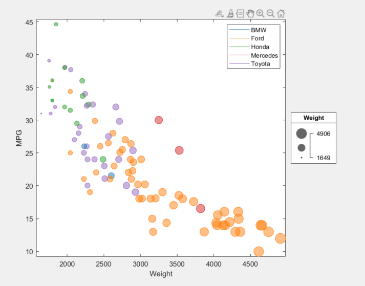

MATLAB
===

After graduating this Spring, I will begin working full time at MathWorks starting in late July. I thought it would be appropriate for me to try to create this graph in the tool I will be developing. 

MATLAB is a programming platform designed specifically for engineers and scientists [6]. Originally it focused specifically on Matrix operations (hence its name MATrix LABratory). However, it has come a long way and is now a popular general use programming language. Although, unfairly in my opinion, MATLAB is losing a lot of users to Python and its various libraries recently. One such library we will look at later in this report.

I think I am lucky to have taken this class when I did, because the latest release of MATLAB, version R2020B released in fall 2020, includes a new feature to easily generate bubble charts [7]! It took a little bit of time to refresh myself on MATLAB syntax and convert the Manufacturer data into the colors I wanted. But overall it was quick and easy to generate the graph. It was very nice that they added this built in bubble chart function. It even has a built in bubble legend! That made creating the main chart easy.

The only issue arose with creating the legend for the colors. MATLAB, like Excel, tries to treat the X axis as the series for the legend. This makes sense, but if you want to plot color, like in Excel, this meant I have to do something hacky. I plotted some dummy data points with no values but the appropriate colors so that I could create a correct color legend [8]. It would be nice to have a built in color legend function, maybe I'll make that a feature when I work there.

Another weird thing, MATLAB uses 0 to 1 for their RGB scale instead of 0 to 255, I found this confusing.

All that said, one nice bonus I wanted to point out is that MATLAB graphs have a lot of cool built in features. Without any additional code they include zoomimg, panning, saving/copying image, highlighting/selecting subsets of the data on the graph, inserting new data points, and many more things. It's a pretty nice feature to include all of these by default.

## How to run
- Make sure you have MATLAB r2020b or a more more recent version installed
- Open ScatterPlot.m in MATLAB
- Run the script and a popup window with the graph will appear

## Sources
1. What is MATLAB?: https://www.mathworks.com/discovery/what-is-matlab.html
2. MATLAB Bubble Chart Documentation: https://www.mathworks.com/help/matlab/ref/bubblechart.html
3. Color Legend in MATLAB: https://www.mathworks.com/matlabcentral/answers/276978-how-can-i-make-legend-by-colors
