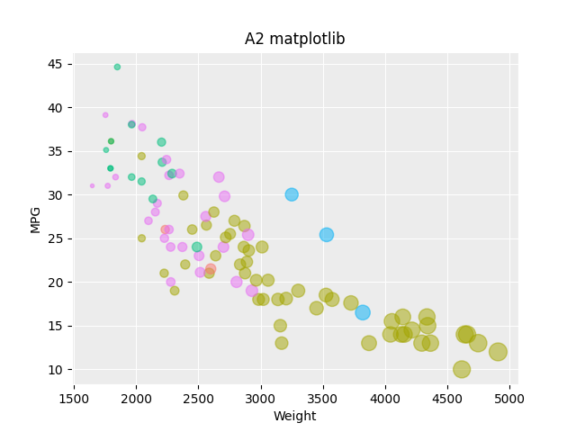

# Python + matplotlib


To quote the Matplotlib website "Matplotlib is a comprehensive library for creating static, animated, and interactive visualizations in Python" [16]. Everyone that has used Python has probably heard of this tool. When I was an SA for the CS 1004, the undergraduate intro to programming for non majors, I had to teach a lot of people how to use Matplotlib. So I thought it would be another good tool for visualizing this scatterplot.

Whenever I have used Matplotlib in the past I've found that it accomplishes 90% of my goals very easily and then some small feature is a challenge to implement. That was the case here too. Apparently, I'm not alone on this either, on their own website they say the following "Matplotlib makes easy things easy and hard things possible" [16]. I completely agree.

The first steps were super easy, I loaded in my csv and I displayed it as a scatter plot with the color and bubble size and all. Displaying the plot once the data is loaded is one line of code:
```
plt.scatter(Weight, MPG, s=BubbleWeight, c=Manufacturer, alpha=0.5)
```
This is simlar to R. R also used only one line to generate the plot. The difference is Matplotlib did not automatically generate the legends. Like with MATLAB and Excel, Matplotlib likes to autogenerate legends for the series data, not the color or bubble weights, so I had to do some hacky coding maneuvers to manually create the legends [14,15]. They do look nice though.

Another similarity to MATLAB, although this time a positive one, the Matplotlib graphs come prepackaged with save, zoom, and pan features without any additionaly code. It's clear why Python is stealing MATLAB users.

## How to Run
- Make sure you have a version of python 3 installed
- Make sure you have matplotlib installed
- Run the scatterplot.py file using the command >python scatterplot.py

## Sources
1. Mapping colors to bubble plots in matplotlib: https://python-graph-gallery.com/272-map-a-color-to-bubble-plot/
2. Adding legends to scatter plots in matplotlib: https://stackoverflow.com/questions/26558816/matplotlib-scatter-plot-with-legend
3. Another article about adding legends to scatter plots in matplotlib: https://matplotlib.org/3.1.1/gallery/lines_bars_and_markers/scatter_with_legend.html
4. Matplotlib docs: https://matplotlib.org/stable/index.html
