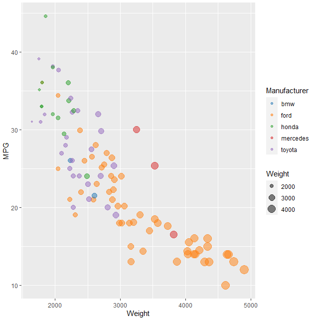

# R + ggplot2

R is a language focused on statistical computing and graphics. One of R's major goals is to provide easy to create, well-designed, publication quality plots. I would say they do a good job achieving this goal.

Before this class the only people I knew who used R were math majors. Math majors are very smart and it's kind of intimidating, so I thought I would never use R myself. But now here I am, having made a bubble chart in R, I can say I am no longer intimidated by it. It was actually super simple to code and it had nice documentation [10]. Creating a graph that matches the given target graph was very easy in R. However, there may be some slight bias here because R was used to make the original graph.

I did face a little trouble getting my custom colors to work in R, but I found a YouTube tutorial that made it easy [12]. YouTube seems to have a lot of good R content. Another problem I had, was I could not figure out how to get the R script to run from it's location, it always ran from the IDE's file path, so I had to hardcode the location of the data csv file.

Overall, I was just very pleasantly surprised about how easy it was to learn and use R is for data vis purposes.

## How to run
- Make sure you have R installed
- Open scatterplot.r in your favorite R editor, I used RGUI but you'll probably want to use R Studio or something nicer
- Modify line 11 of the file to have the correct file path to the .csv file
- Run the script to view the visualization

## Rankings/Stats
This section ranks this tool in several categories compared to the other tools I used for this project:

## Sources
1. About R: https://www.r-project.org/about.html
2. Bubble plots in R: https://www.r-graph-gallery.com/320-the-basis-of-bubble-plot.html
3. Importing CSV Data in R: https://datatofish.com/import-csv-r
4. Guide to ggplot Colors: Working with Manual Color Scales for Categorical Data:
 https://www.youtube.com/watch?v=h8dn6nbCznQ&ab_channel=MichaelToth