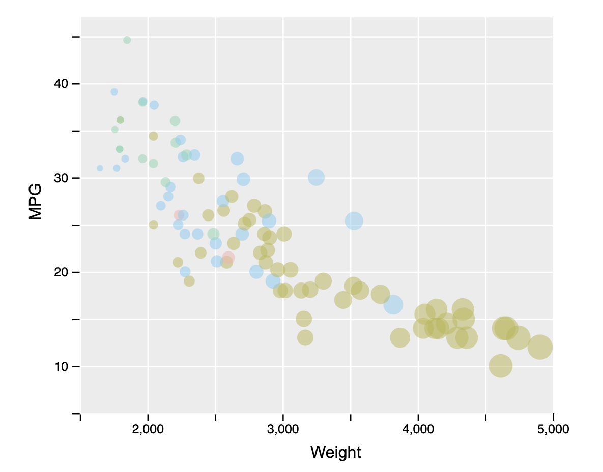
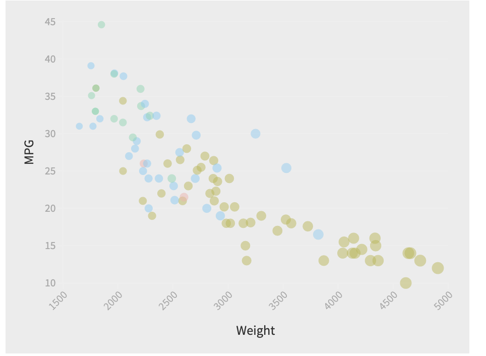
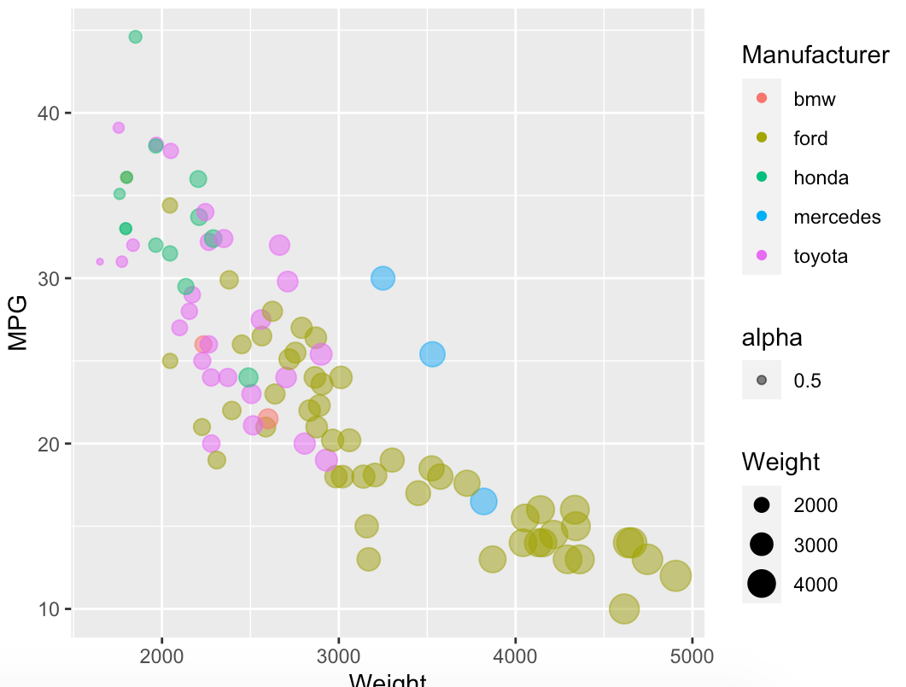
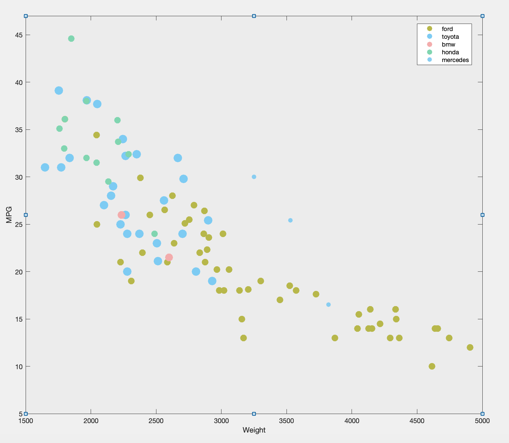
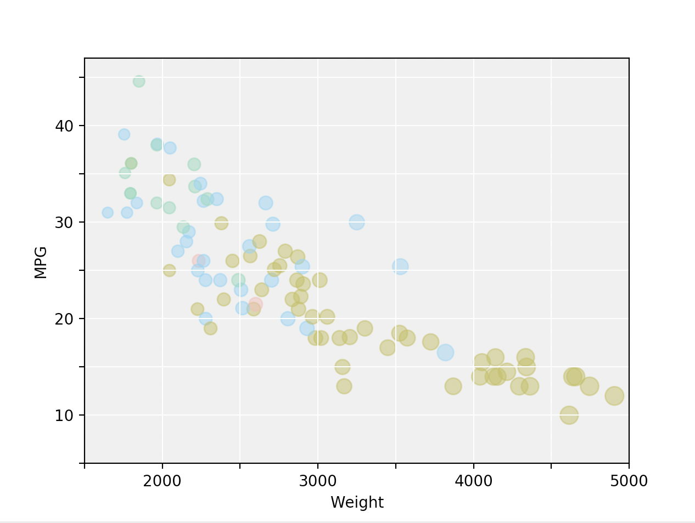
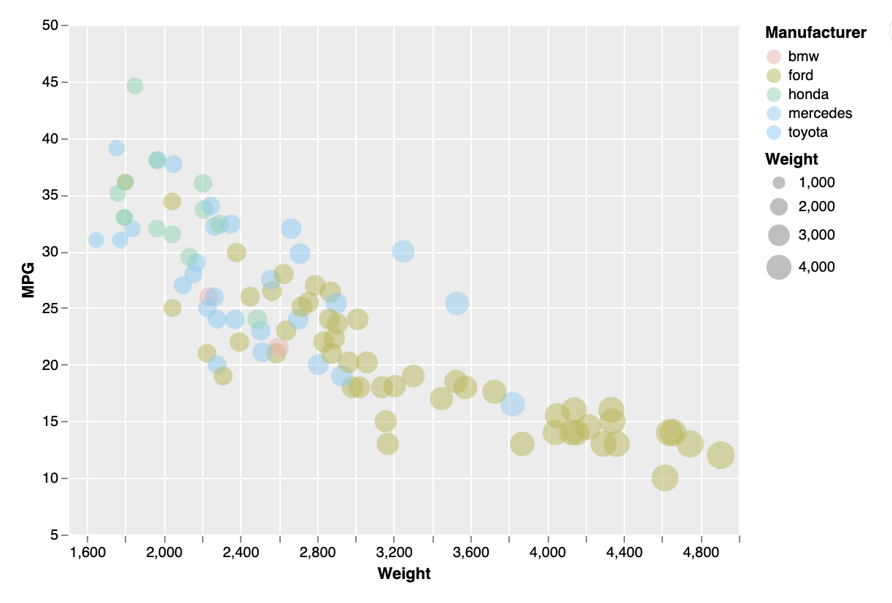
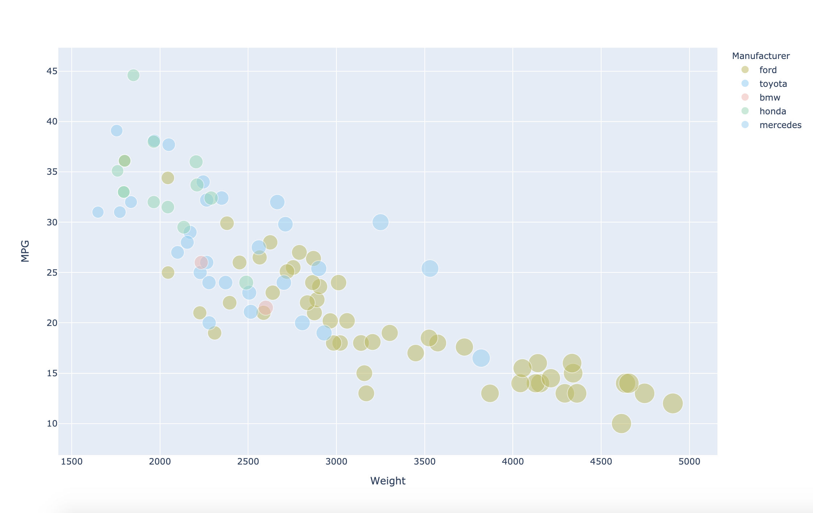

Assignment 2 - Data Visualization, 7 Ways  
===

# Example R + ggplot2 + R Markdown

What was easy? Difficult? Where could you see the tool being useful in the future? Did you have to use any hacks or data manipulation to get the right chart?

# D3...

(And so on...)

Get Started
- Cd Into the D3 folder
- Open a terminal at that location
- Run a local http server. ie: python -m SimpleHTTPServer

# Flourish ...

Get Started
- Cd Into the Flourish folder
- Either open the terminal and enter open . then double click index.html
- Or open the terminal and enter open index.html in the command line.

# GGPlot2 ...

Get Started
- Open R Studio
- Open Plot.R
- Run install.packages("ggplot2") to install ggplot2 and initalize it
- Make sure you know the location to the cars-sample.csv
- Hit Run

# Matlab ...

Get Started
- Open Matlab
- cd into the folder Matlab and make sure that contains Plot.m and cars-sample.csv.
- Make it your working directly
- Open Plot.m
- Hit Run

# Matplotlib ...

Get Started
- cd into Matplotlib folder.
- pip install matplotlib, if you don't have it already
- Open the terminal, run python Plot.py

# Vegalite ...

Get Started
- Cd Into the VegaLite folder
- Open a terminal at that location
- Run a local http server. ie: python -m SimpleHTTPServer

# Plotly ...

Get Started
- cd into Plotly folder.
- pip install plotly plotly-express pandas, if you don't have it already
- Open the terminal, run python Plot.py

## Technical Achievements
- I was able to implement numpy genfromtxt in order to render a graph in Matplotlib without the use of Panda
- I was able to translate between datatypes in order to match csv values manually with a self created dictionary in python. Translation was done between NumpyArrays and standard Python Dictionaries
- Dynamically used recursion to implement grid lines in certain tools that did not have easy support of creating a grid

### Design Achievements
- Visually, I was able to rerender a grid background in every tool I used. This came in many forms. For D3 for instance I used the power of their custom objects to render the gray overlay. In the case of Vega Lite I utilized the html canvas to render the gray background
- In order to show every other label on the axies, I manually manipulated the dom to remove ticks in order to more reflect the original plot
- Utilized Cascading Styling Sheets (CSS) in some cases to override html elements in order to fully match the appearance to the original plot 

