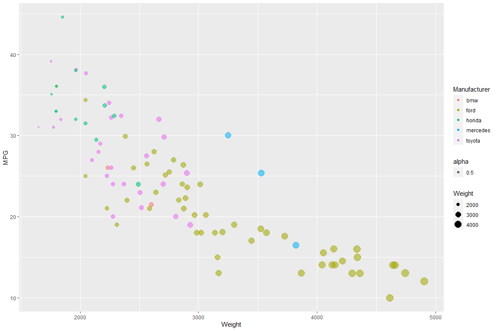
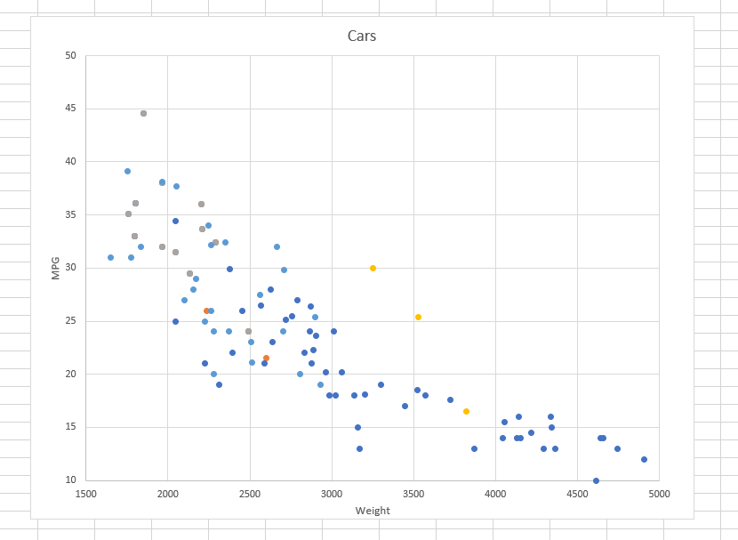
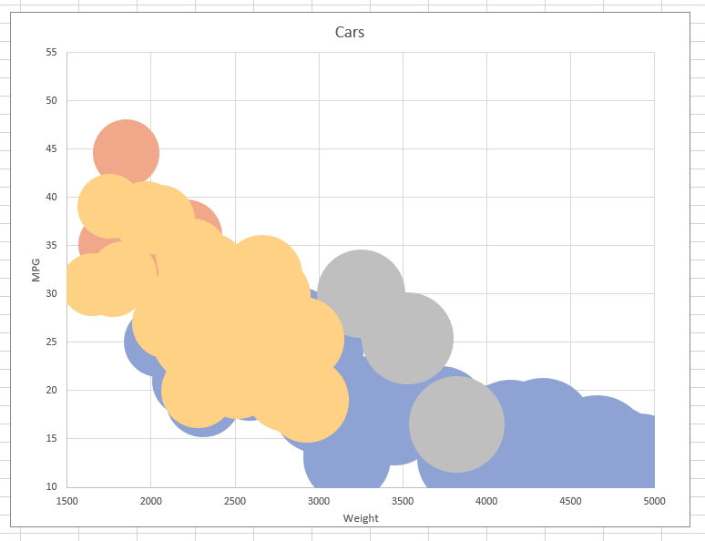
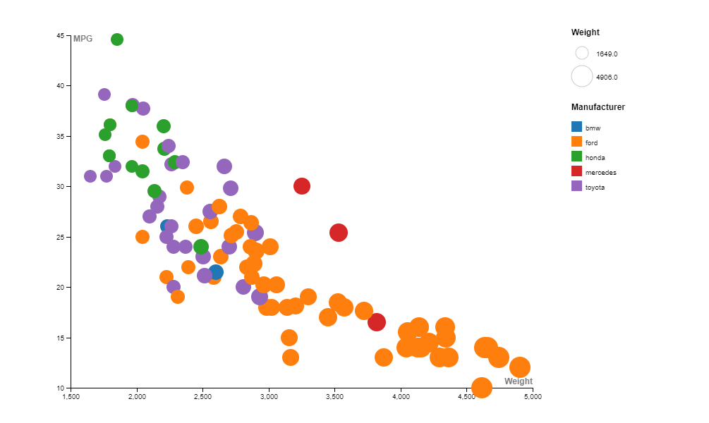

Assignment 2 - Data Visualization, 7 Ways  
===

Below are 7 visualizations of a simple scatter plot that I replicated within various data visualization tools and libraries. Following each visualization are some of my thoughts on my experience with that tool.

# d3

I decided to make my first visualization with d3, as I figured it would make sense to begin with the data visualization software we will be using it for the rest of the class. Despite having little issue with assignment 01, I ran into a couple problems getting my initial scatterplot working as intended. The combination of cars-sample.csv having some rows without numerical values ("NA" in MPG) and my misunderstanding of margins brough me to a standstill. Perhaps I missed a mention of this in class (more likely, I just wasn't prepared to debug!). Regardless, it took me a significant amount of time to decipher exactly how to define margins so that both axis would show up. Once I did, changing the color and shape of the circles was trivial.

// how to set up margins - https://gist.github.com/jsoma/71bee11bbe6b73887bca4138fd4d2442
// axis labels - https://bl.ocks.org/d3noob/23e42c8f67210ac6c678db2cd07a747e

# Flourish

After spending more time than I initially expected working on my d3 visualization, I decided to try making visualizations without writing any code. Flourish is a visualization tool designed for non-programmers, allowing users to quickly upload data, create and customize visualizations from templates, and publish them online. Working with Flourish was floud and painless - within three minutes of uploading the csv, I had a working scatterplot with all required features. Flourish seems particularly customizable, as I was able to add a legend and trend lines (for each color) easily. The legend was even interactive by default; while this is very possible in d3, it would have taken a novice like myself much longer to develop that feature. Navigating between the Preview and Data tabs was intuitive, and I appreciate the effort to treat the Data like an Excel spreadsheet, as most users will have interacted with Excel before. Flourish appears to be a great modern data visualization tool for anyone with no time to learn programming, and desire for more quality than old faithful, Excel.

// how to make a scatter plot in flourish - https://app.flourish.studio/@flourish/scatter

# Python + matplotlib

I had a fairly easy time working with matplotlib, the visualization library developed in Python. Having worked with Python many times, I was comfortable creating arrays of attributes out of arrays, and simply passing them in as arguments to a scatterplot function. As I finished my visualization, I realized that one reason I struggled slightly with d3 is the way it handles data is so different to what I am used to. Matplotlib offered a solution that immediately made sense to me, but would appear to be less elegant the more complex the visualization. I did appreciate pyplot's interactive window, which gives the user the ability to pan and zoom around the figure by default.  

// how to make a scatter plot in matplotlib - https://matplotlib.org/stable/gallery/lines_bars_and_markers/scatter_demo2.html

# R + ggplot20

I had never used R before, so I expected there to be a lot more for me to learn! As it turned out, all I needed was one line of code to read in the csv, and two lines to create the scatterplot. R even automatically removed the two rows in cars-sample.csv that did not contain values for MPG. I was very surprised to find out how easy R was to work with. Again, it seems like d3 would still be the best option for truly detailed and interactive visualizations, even though R has adjusted scales and labels out of the box.

// how to make scatterplot in R - https://www.guru99.com/r-scatter-plot-ggplot2.html

# Excel

I have used Excel before to create simple graphs and charts, but never tried to change the basic layout / features of what I created. I was hoping for a similar experience to the other visualization tools I used; however, I quickly found that Excel certainly was not designed with visualization in mind. What in Flourish was intuitive and easy to follow, was in Excel confusing and hard to find. Changing the colors of points based on manufacturer required me to separate the dataset into five "series." Changing the size of the point I was incredibly hard, and the final result does not even look as desired. I made a separate column and divided the weights by 1000 in an attempt to make the bubbles smaller, but it did not appear to work. Even changing the opacity of the points proved undoable. While Excel certainly is useful in data manipulation, I would recommend exporting your data as a csv and looking to other data visualization tools.

# Tableau

Tableau required registering an account and downloading an application to use, meaning it took longer to get to my visualization than both Flourish and RAWgraphs. Once I uploaded my data source and got to my sheet, I was initially unsure of what to do. The actions I should take to create a visualization were not as immediately clear to me as they were with RAWgraphs. My first attmpet resulted in creating a singular x,y point of the sum of both MPG and Weight. I eventually realized I had to change the column and rows to be "dimensions" as opposed to "measures." I chose to not change the opacity of the points, as Tableau had the brilliant idea to make points empty circles by default, which I would argue is even better for identifying distinct data points than change alpha levels. Overall, I am sure that with necessary practice Tableau would be a very useful vis tool.

# RAWgraphs

RAWgraphs suprised me by being the most user-friendly vis tool I ended up using. It was not on the suggested tools to try, so I thought I would give it a shot, as my roommates recommended it to me. After uploading data, RAWgraphs presents the user with a choice of chart options. Once I selected a chart, I was given a very simple drag-and-drop template for choosing which attributes of my dataset to show on my graph, making it clear which kinds of data (nominal vs. interval). This made it incredibly easy to set the color and size by weight and manufacturer. The result was a chart with some limited customization options, but overall was the smoothest experience, even outclassing Flourish and Tableau. I should mention that I was unable to change the opacity as well, which I found odd for an otherwise very useful tool. If I ever need to quickly create a visualization online and download a quick picture, I would pick RAWgraphs.

