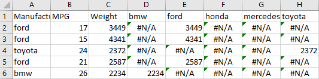

Assignment 2 - Data Visualization, 7 Ways  
===
#### By Andrew Nolan

For this assignment we are tasked with recreating the following graph using 7 different tools.

This graph was provided by Professor Harrison along with a cars dataset

For this project I chose the following 7 tools, I will discuss them in more detail in the sections below:
1. Microsoft Excel
2. MATLAB R2020B
3. R + ggplot2
4. Python + Matplotlib
5. d3
6. Vega-lite
7. Tableau 

## Excel

The first step on my journey into datavis was excel. Whenever I explore a new csv file this is usually my first step because I can quickly throw together a scatterplot or other visualization with minimal efforst. So I was very surprised to discover this would be the hardest tool to use. 

Excel does not do a great job at making complex graphs. It is strict in its requirement for the number of series affecting the data points. With a bubble chart it expects three values: x, y, and bubble size. To add a fourth value of color a lot of hacky maneuvers need to be taken [1]. For each different color/manufacturer type, I had to create a separate series and put the weight (x values) in that and #N/A values in the column for when it was not of that type. You can see a subset of this change in the data below. When a car was a Ford it's weight would go in the ford column and a #N/A value would go in the others. Then each of these would be plotted on the graph as different colors. The nice part of this is it allowed the color legend to be auto generated.

Another major draw back was there appears to be no built in way to add a weight legend to the Excel graph. Excel does support VBA scripts but I wanted to try to do everything purely with Excel. So for this legend I had to add a textbox and manually draw the weight cirles. It's tedious and not automated, but it doesn't look bad.

Excel took me a very long time to complete compared to some of the others. It's very limited in what it allows and doesn't allow much customization beyond their given features. I would not recommend Excel for fancy visualizations, but I would say it's a good choice for very simple, quick graphs like basic bar charts or 2 feature scatter plots.

## MATLAB R2020B
After 

- I work there
- New R2020B feature makes it much easier (bubblegraph)
- Hacky color legend
- decently long to get hacky color
- lots of cool built in features

## R + ggplot2
- Super fast
- easy documentation
- does what you say

## Python + matplotlib
- hard to get custom colors working
- medium amount of time
- legends not automatic

## d3
- very open ended
- can do whatever you want
- pure code nothing automated really
- long but good documentation

## vega-lite
- Super easy to use
- I liked the json format, it was clean to me
- does what you say and does it nicely
- hard to adjust size

## Tableau
- very easy no documentation needed
- fast and learnable
- does everything

# Achievements

## Technical Achievements
- **Made a website with bar charts comparing the results** Bar charts showing the ranking comparisons of different groups. Rank by ease of use, quality of documentation, size of file, built in features, dynamicness (how much you can customize), hackiness, vibe
- **Imputed values for the MPG NA instead of skipping them** I noticed the only two NA values in the MPG column were for 8 cylinder Ford cars. So I wrote a quick Python script, [imputeMPG.py]() in this repo, to calculate the average MPG of 8 cylinder Fords, I then used that imputed value in the place of the 2 NA values in the visualizations.

## Design Achievements
- **Legend Consistency**: Although it was sometimes through very hacky means, I was able to ensure all of the required components of the graph as well as the optional legends were included in every graph. Some tools did not easily support the weighted graph and it needed to be manually drawn.
- **Ensured Colorblind Appropriate Colors**: Instead of using the default R categorical colors, I decided to use a predefined color pallette that would display categorical data in a distinct way. I chose the d3 catgory 10 color pallette, and then used the first 5 colors. I tested the results for someone with tritanopia, protanopia, and deuteranopia using the chrome plugin: "Colorblinding" found here: https://chrome.google.com/webstore/detail/colorblinding/dgbgleaofjainknadoffbjkclicbbgaa/related?hl=en. The categories are still distinct with this color scale, sadly the transparency makes it a little hard to see still.

Colors: 
rgb(31, 119, 180); #2377B4
rgb(255, 127, 14); #FF7F0E
rgb(44, 160, 44); #2CA02C
rgb(214, 39, 40); #D62728
rgb(148, 103, 189); #9467BD

# Sources
### Excel
1. Conditional Coloring in Excel: http://daydreamingnumbers.com/how-to/conditional-colouring-to-scatterplots-in-excel/
2. Conditional Coloring in Excel: https://stackoverflow.com/questions/15124103/excel-how-can-i-make-a-scatter-plot-which-colors-by-a-third-column
3. Bubble Charts in Excel: https://support.microsoft.com/en-us/office/present-your-data-in-a-bubble-chart-424d7bda-93e8-4983-9b51-c766f3e330d9
4. Editing Legends: https://support.microsoft.com/en-us/office/modify-chart-legend-entries-d822dd57-af28-4c3e-93d1-d320e6239843
5. Multiple legends in excel https://stackoverflow.com/questions/33230348/multiple-legends-in-excel-chart
