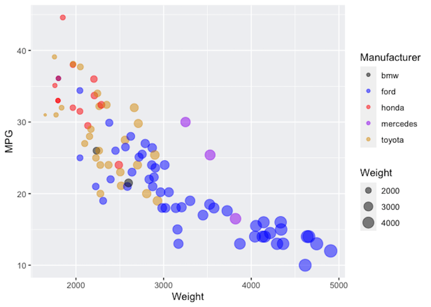
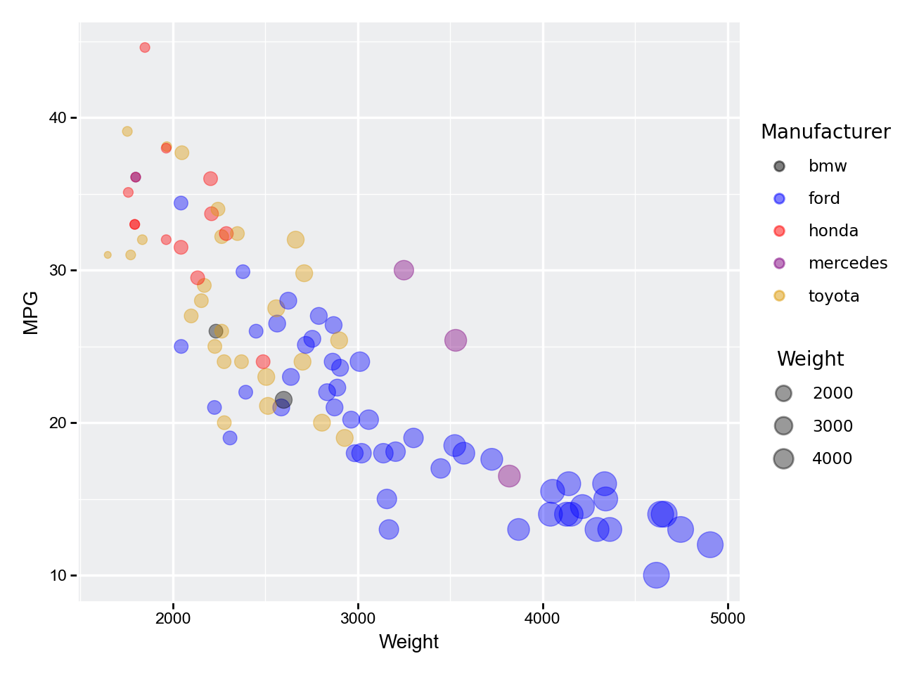
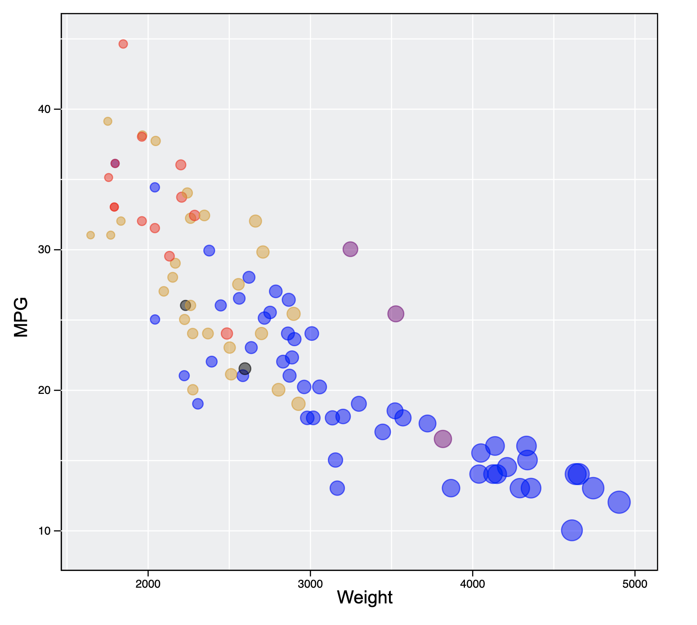
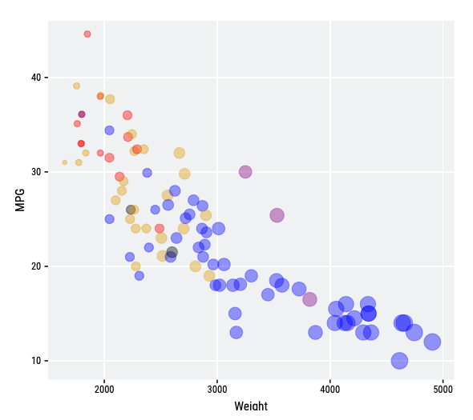
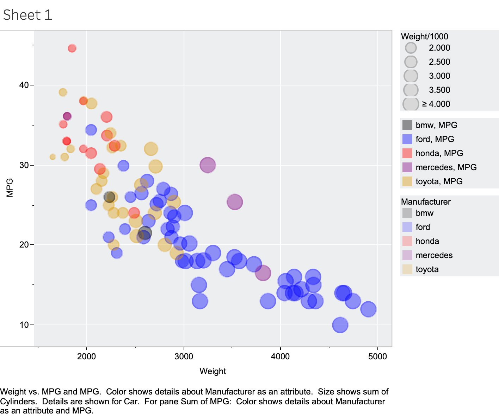
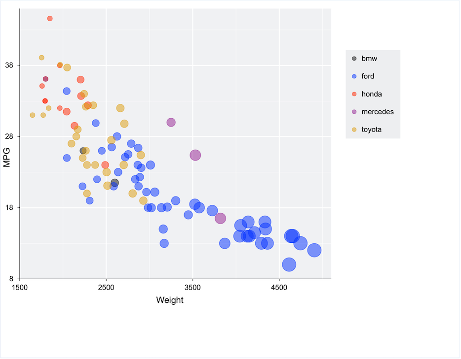
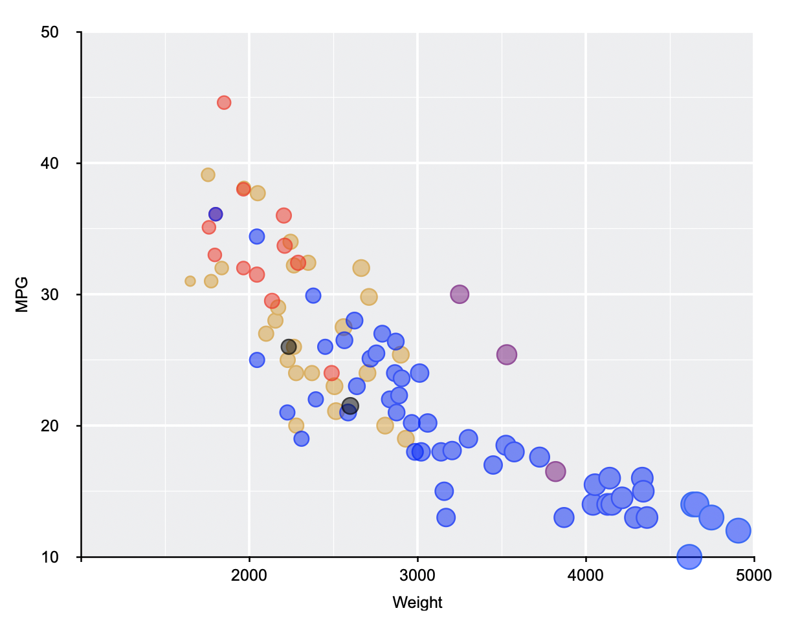

# Stephanie Strom 02-DataVis-7ways

Assignment 2 - Data Visualization, 7 Ways  
===

# R + ggplot2

I used RStudio and a tutorial video to replicate the chart for the assignment and used this as the starting point to consistently replicate in 6 other tools. I made changes to the color of the marks and background. It was pretty straightforward to use this tool following the tutorial - [Tutorial - Data Visualization in R With ggplot2](https://learning.oreilly.com/videos/data-visualization-in/9781491963661).

# Matplotlib

It was challenging just to get the libraries installed correctly. I am not very proficient in Terminal and things kept going wrong. And I have never worked in Python before either. Once I got things working I watched this 10-part series of tutorial videos to learn how to make charts in Matplotlib - [Matplotlib Tutorials](https://www.youtube.com/watch?v=UO98lJQ3QGI&list=PL-osiE80TeTvipOqomVEeZ1HRrcEvtZB)

Once I got up and running I was pretty pleased with my results. It was easy to map the data to the size and color of the marks. Having a ggplot style template helped! I used the Matplotlib API to format the grid. This question from Stack Overflow helped in figuring out the legends - [Adding Second Legend to Scatter Plot](https://stackoverflow.com/questions/43812911/adding-second-legend-to-scatter-plot)

# d3

It was challenging to replicate the chart in d3. I used what I learned in class to plot the marks and to style the color and size. The following websites were helpful in formatting the graph, but I was unsuccessful in attempting to make axis labels and get more of the details that I was able to get in other tools. 

(https://www.essycode.com/posts/adding-gridlines-chart-d3/) 
(https://www.d3-graph-gallery.com/graph/custom_theme.html)

# Flourish

[My Flourish Chart](https://public.flourish.studio/visualisation/5314239/)

Flourish was pretty straightforward to use and was simply a matter of modifying all the options to match the style of the chart. There is no option for minor gridelines. So I chose to only have major gridelines rather than increase the number of tickmarks. The options for the legend are only top and bottom so I decided to leave the legend out for this tool. I used an "Adjust" column for size of the marks with a range of 0.5-7 (broken down every 500 lbs) to get more variation in size of the marks rather than using the weight data which did not give much variation in size. I also put the opacity to 0.4 because that seemed to match the other chart better than 0.5.

# Tableau

I found Tableau fairly frustrating to use. I found the GUI to be confusing and unintuitive. Color options were limited. I couldn't find a way to add a border to the marks that matched to border fill color. The options seemed to be to have one border color for all marks or no border. I did find a workaround by making it a dual-axis scatter plot. I don't think there was a way to turn on minor gridelines but there was a way for minor tick marks. Seems like it is more geared to analyzing data than to easily creating visualizations. 

# Excel

Creating the chart in Excel was pretty easy though it did require some manipulation of the data to get the desired color and size of the marks. To meet the requirement for color by manufacturer and size by weight I seperated the data in to series. I split the weight evenly in 500 lb increments so I needed 7 series just for Ford for example. I could not figure out how to get the tick marks to start somewhere other than the start of the range. So on the x-axis they start at 8 instead of 10. Also the format of the tick marks seems connected to the border of the axis so I was not able to match that exactly to ggplot. Excel had limited legend options.

# Numbers

I considered learning a fourth library but after the considerable time and effort I put in to Matplotlib and d3 I was short on time and patience. So I decided to see how Numbers compared with Excel since I am a Mac person. It was a fair amount of labor getting all the data styled as 17 seperate series, but at least it was mindless labor. Similar to Excel you can't have tick marks without an axis line. To get the tick marks to land on nice even numbers I had to extend the min/maxes because it sets the ticks at intervals based on the chart area. Opacity didn't quite work how I wanted to. It works between series but not within series.

I found it harder to use than Excel and it doesn't have very sophisticated charting options. It might do in a pinch for a simple dataset. 

## Technical Achievements
- **Tableau**: Created a custom color palette by going in to the preferences file. Also added color matching borders to the marks which I thought was going to be impossible following this website [playfairdata.com](https://playfairdata.com/3-ways-to-make-stunning-scatter-plots-in-tableau).
- **Matplotlib**: I was quite pleased with my results considering I hadn't used Python before. I put extra effort in to getting the two legends to the right of the graph and to making the style and formatting consistent with the starting graph.
- **Sizing**: I spent a considerable amount of time getting the size of the marks consistent between tools. Many of the tools had an automatic way to size based on the attribute of weight. However I found that making a seperate attribute which I called "Adjust" with a range of 0.5-7 dividing the weight in increments of 500 lbs gave me results closer to the ggplot mark size for some of the tools.
- **Learning libraries and languages**: This class is my first experience using any of these tools (other than Excel) and languages. It's quite a learning curve.

### Design Achievements
- **Color**: I changed the color scheme. I thought primary colors looked good at the 50% opacity with a variation of goldenrod instead of yellow and I also made the background a different gray color to help with mark visibility.
- **Consistency**: I put a lot of effort in to getting consistency in the small details wherever possilbe: size, color, opacity, edges of the marks; font, font size, font color; gridelines, tickmarks, and legends.
