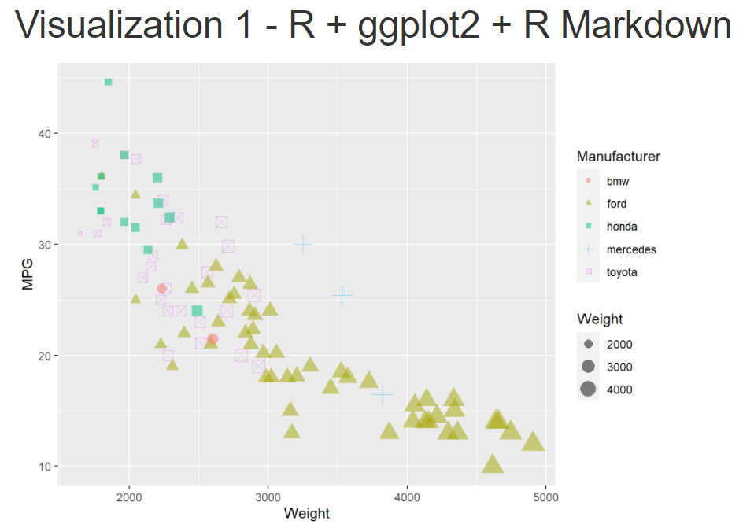
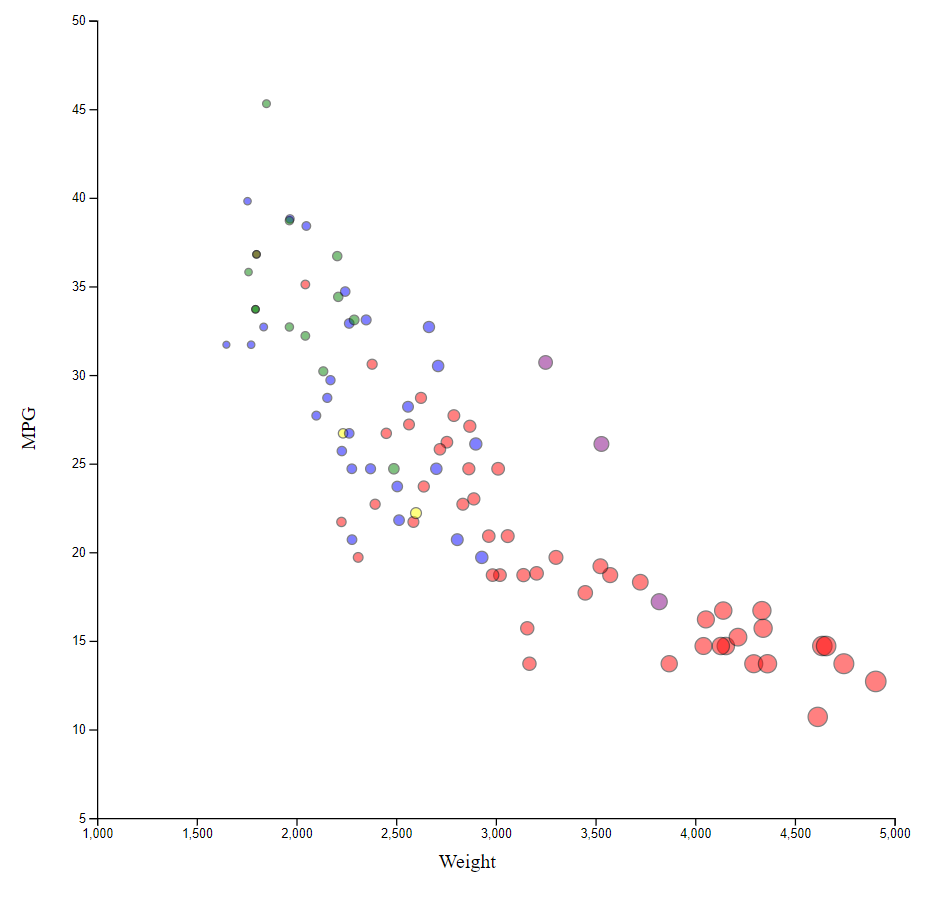
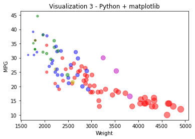
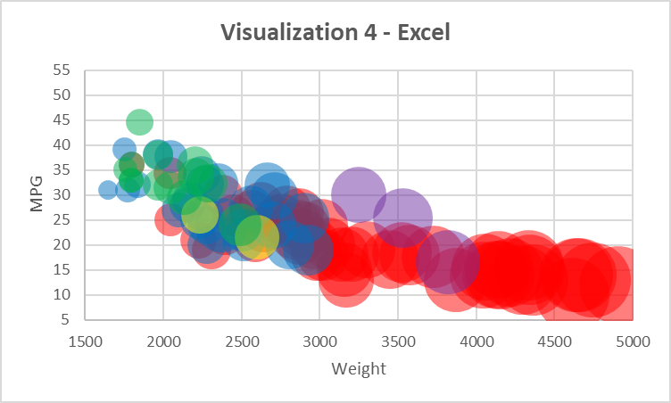
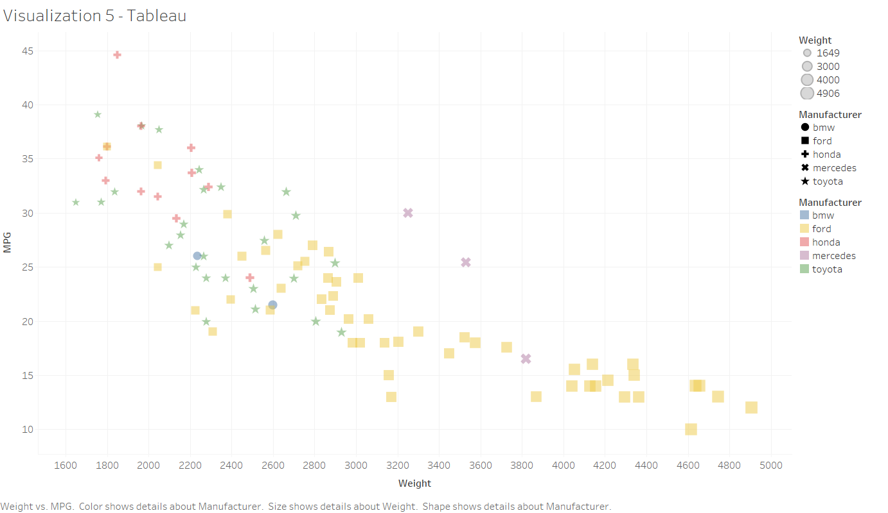
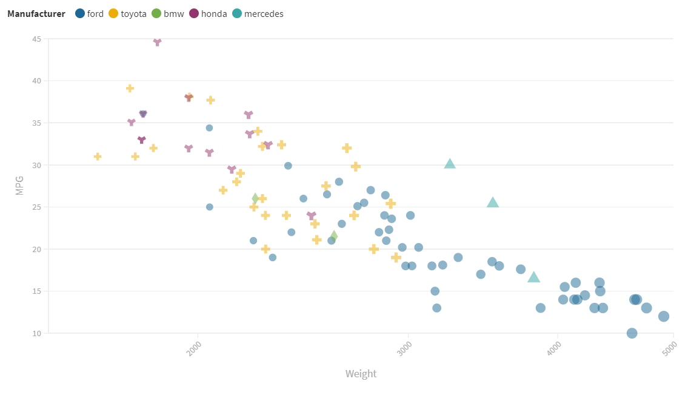
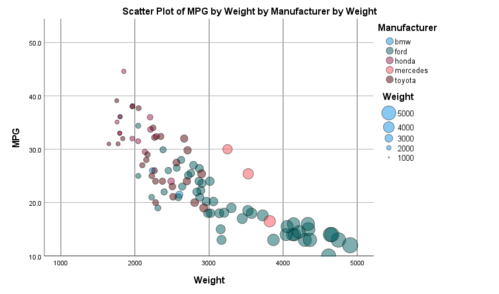

# Assignment 2 - Data Visualization, 7 Ways

## Visualization 1 - R + ggplot2 + R Markdown

R is used as a language to handle statistical computation and graphics rendering. ggplot2 is a data visualization library for the language. Finally, R Markdown is a document formatter which was used to export an HTML webpage of the result.

While the language loading and data imports takes two lines of code, the actual data visualization can be summed up in a single line. Plotted data can be represented using the `ggplot` method while point data can be supplied and drawn via `geom_point`. Since it also supports dynamic enum differentiation per object column, the data could be imported as is and drawn.

Since this was the representation trying to being created shown in the example, there wasn't much difficulty in use. For standard graph creation, I would say this is a worthwhile tool to use because of its simplicity.

## Visualization 2 - Javascript  + d3

Javascript is a JIT (Just-In-Time) compiled language with first-class functions mostly well known within web pages. d3 is a library for data visualization within the language.

The library doesn't abstractly support default scatter plots; however, they can be built with a bit of effort. Each scale and label must be drawn by appending a random element that calls the axis function and a text element respectively. They then must be attached with scaled attributes that can rotate the elements to match the base requirement. The points can be drawn by simply apply a geometric shape element and attaching the required attributes. To handle dynamic coloring, there is an additional function that associates a new color if the existing enumeration has not been seen before.

While this wasn't entirely difficult, it did require a much more in-depth knowledge of the system to try and handle it effectively. Even still, the abstraction needed to make this viable for standard graphs makes it unnecessary to use for this context.

## Visualization 3 - Python + matplotlib + pandas + Jupyter Notebook

Python is a popular scripting language used to represent and prototype a general populous of items. matplotlib is a library used to create vizualizations within the language. pandas is another library that is geared for data analysis of specific formats. Finally, Jupyter Notebook is a web based application used to execute programs live easily.

pandas was first used to import the data as a `DataFrame` via `#read_csv`. To properly assign color and size, two new columns were created which took in a pre-existing column and returned a new column containing the modified data. This is because attribute data is not assigned on a per-object basis but rather specified as a general column to look-up from. From there, it was the simple matter of using the `#scatter` method to plot the data and then `#show` it.

This was one of the more difficult tools as a lot of the methods were quite non-intuitive to use from an implementation standpoint. While it can be done, I would not recommend this tool for standard graph use.

## Visualization 4 - Excel

Excel is a spreadsheet rich editor used to analyze data.

To properly get Excel to display the data in a 'sane' manner, it had to be broken into a few parts. First, size is represented using a bubble chart. Second, to split each data into valid colors, every enumeration was separated into a different column which used a conditional check to see what value the enumeration was. Each series was then imported separately with the color and transparency adjusted for each.

This was a terrible tool to use in this specific use-case. Size is relative to all points, so regardless of the adjusting, the data points are scaled to the same size. This results in a difficult understanding with data cluttering. To counteract this, a separate graph was implemented with a scatter plot to show exactly where the data was. While a good general purpose graphing tool, it fails in this comparison.

## Visualization 5 - Tableau

Tableau is an editor used to show and analyze data usually in a visual format.

Using the visual editor, all that was needed was to drag and drop the required attributes into their specific location and specify the changes as needed. The alpha was also quite handy as it addressed for the entire dataset as a whole.

Although the tool is quite easy to use for this situation, the size attribute is not very well scaled or distinguishable without a few glances. It's not well adjustable for a exponential exaggeration as needed.

## Visualization 6 - Flourish

Flourish is an online graphical visual editor.

This program was even easier to use than Tableau as the data was per object once again and attached to a specific column. It can also be easily imported to a webpage using an embedded script.

However, once again, it suffers from the same issues as Tableau while being easy to use. The size is not easily distinguishable because of relative scaling.

## Visualization 7 - SPSS

SPSS is a statistical software package used for interactive statistical analysis. For comparison, its a more complex Excel with access to low level commands.

While the visual graph builder does supply an intuitive-to-use interface to drag and drop the required data representation, it does not provide access to point-based alpha channel. However, the low level access does allow us to accomplish this by simply adding two additional parameters to the end of the element configuration: `transparency.exterior` and `transparency.interior` which was specified with a static value of `transparency."0.5"`.

This was probably the easiest of the above visual tools to use even with the minimal BASIC injection. However, as a modern day program, it barely compares to the functionality and power behind general purpose programming provided in the first three visualizations. As such, it is a bit outdated.

## Achievements

### Technical

#### Perfect Design Replication

All libraries represented is able to represent the required points accurately. Although they may not all represent the data clearly due to relative scaling via program limitations, it still provides the necessary data.

#### Configurable Data Implementation

Most of the visualizations shown is based solely on data with no hardcoded attributes. This is to better adjust the programs to provide dynamic switching of the underlying dataset. Only d3 and Excel do not support this. Excel would need to change column size depending on the inputted dataset while d3 has so many attributes that it would need to recalculate that its not worth the compile-time no matter how negligible. d3 would need to be highly abstracted at the graph level to make this a feasible choice.

### Design

#### Colorblind Friendly

Some of the visualizations that support different shapes based on enumeration modifies the circles to be different shapes. This is to support those who cannot detect a difference in color. d3, matplotlib, and SPSS do not support this. SPSS and matplotlib just doesn't have an easy-to-implement capability for this to occur. d3 also doesn't easily support this; however, I do have a work-in-progress library that would allow this to occur in the future.