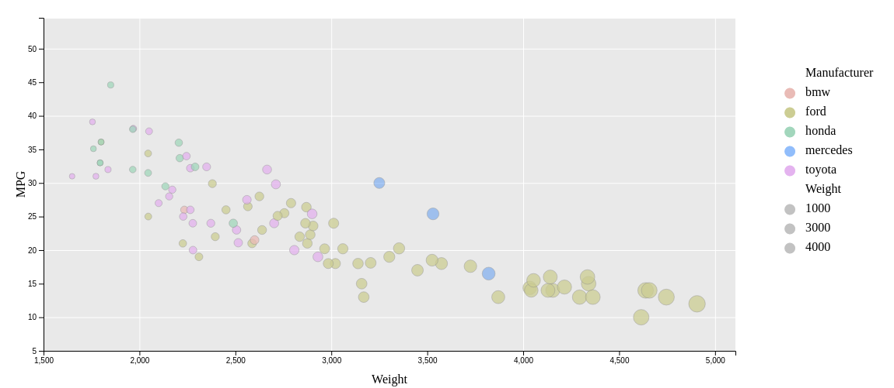
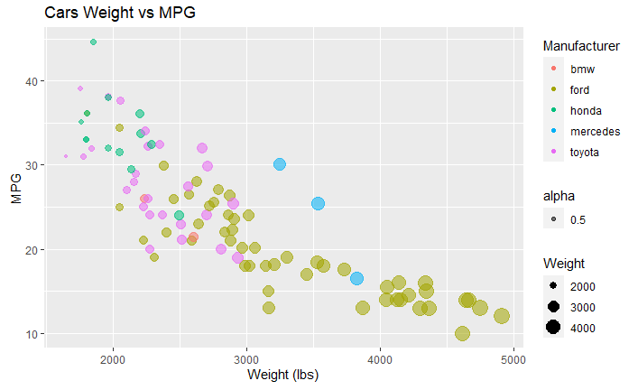
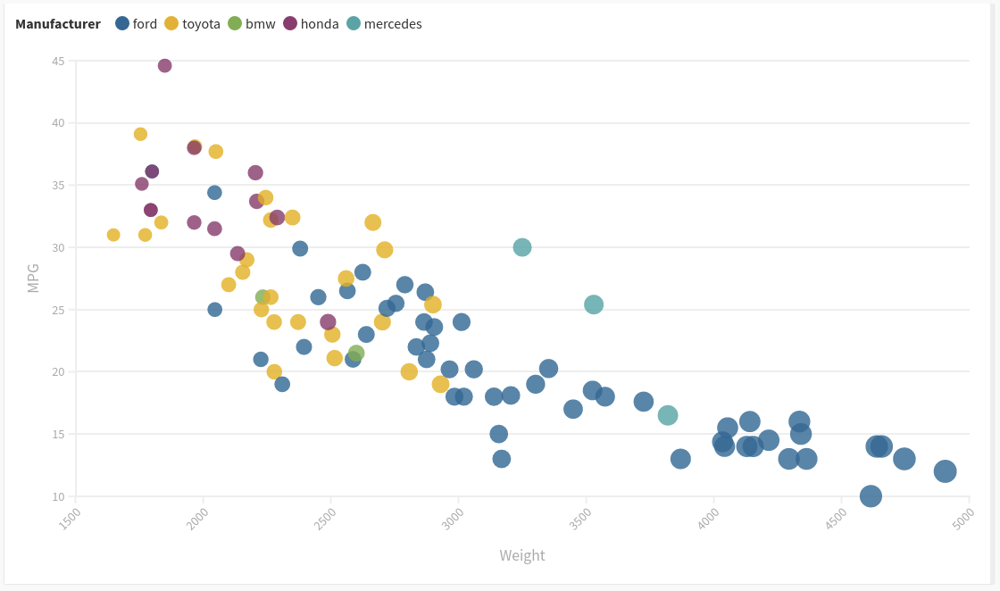
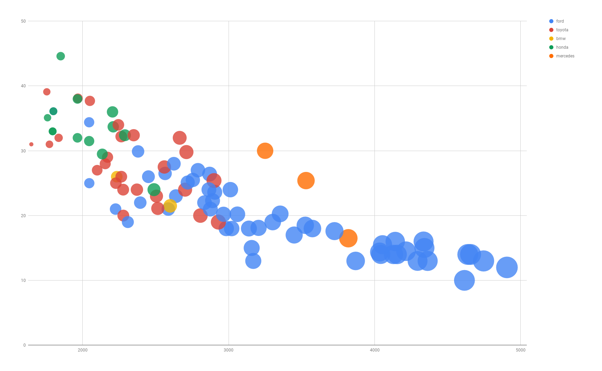
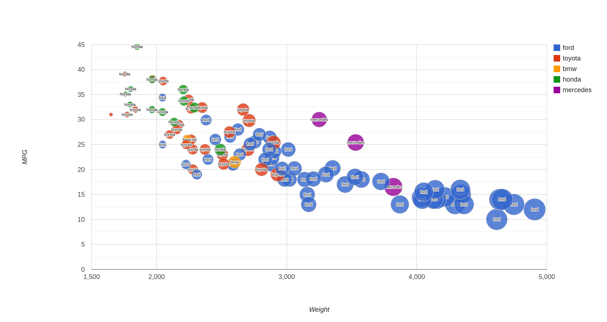
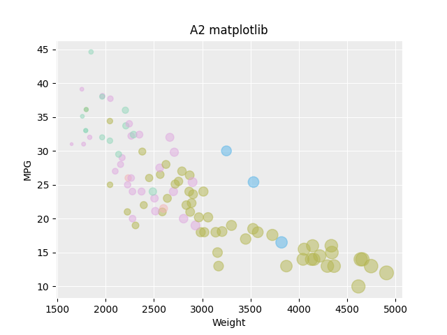
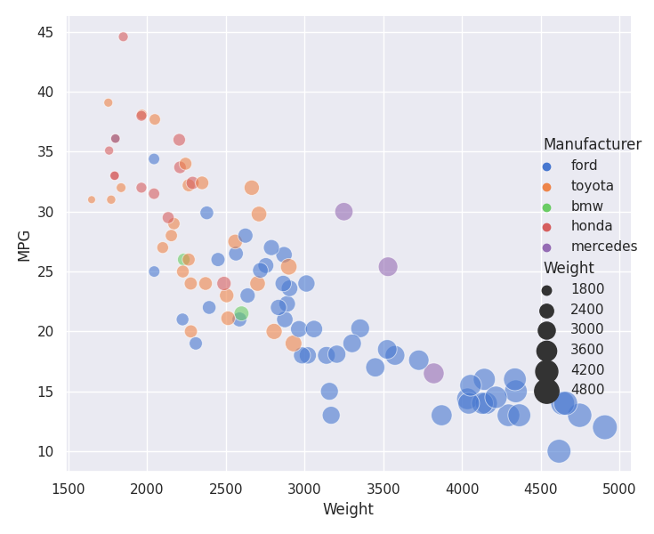
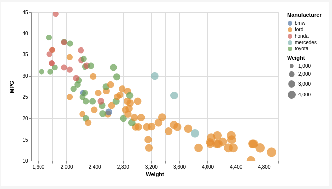
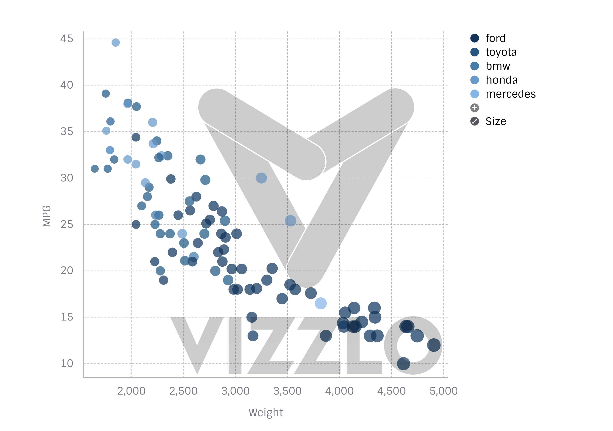
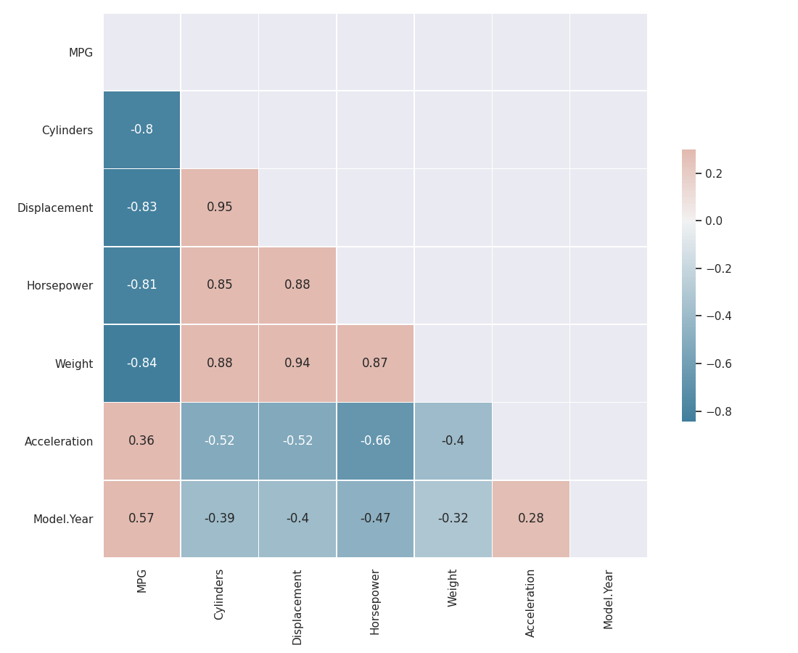

# 02-DataVis-7ways

Assignment 2 - Data Visualization, 7 Ways  
===

D3 Viz
------
It took a while to find the correct examples, but it was rather straightforward to put together the visualization code once I found them. Obviously, there is a strict requirement to have a good understanding of SVG and javascript to work with D3, which would affect the coding experience more than the access to the sample code. 

R Viz
------
Working on the R code requires a good understanding of writing code in R and ggplot2. Although the setup can be time-consuming, R has excellent documentation and StackOverflow community for support, so it's very straightforward and easy to work with R. 

Flourish Viz
------
Flourish has a very intuitive UI, and anyone who can drag and drop files around a PC can use flourish to generate the visualization.

The viz was generated using the online editor for [flourish](https://app.flourish.studio/visualisation/5408923/).

Google Spreadsheet Viz
------
Working with google spreadsheet took a while to figure out as I initially tried to generate the visualization using LibreOffice Calc, which was a huge mistake, to put it mildly. The google spreadsheet guides are not very good or readily available, but if you have access to Excel tutorials, you can easily replicate the work in google spreadsheet.

Google Charts Viz
------
The google charts visualization is very straightforward, and some level of understanding of JavaScript, HTML, CSS, and JSON will quickly help you figure out the visualization. Additionally, google charts have excellent documentation, which is very helpful. If anything, Google products are often over-engineered, and the only problem I had with Google Charts was reading through unnecessary and heavily redundant documentation. 

Matplotlib Viz
------
Working with Matplotlib requires understanding data frames, NumPy, and other python libraries associated with Matplotlib.

Seaborn Viz
------
Similar to working with Matplotlib, Seaborn requires understanding knowledge of data frames, NumPy, and other python libraries that are dependencies associated with Matplotlib and seaborn.

Vegalite Viz
------
If you understand JSON and have access to Vegalite documentation and examples, working with Vegalite is straightforward and simple. 

The viz was generated using the Vegalite [online editor](https://vega.github.io/editor/#/examples/vega-lite/circle_bubble_health_income). The JSON code is in the Vegalite folder. If you replace the default JSON with the custom JSON I wrote, then the chart will get rendered.

Vizzlo Viz
------
Vizzlo has a very intuitive UI, and anyone who can drag and drop files around a PC can use Visslo to generate the visualization. The free version has limited features, making things difficult if you want to use the images on documents.

The Visslo viz was generated using the vizzlo online editor.

## Technical Achievements
The technical achievements associated with this project revolved around the missing nan values in the data for MPG. The Weight, displacement, and horsepower all were correlated more strongly than the traditional measure that people are more interested in when talking about engines 'The number of Cylinders.' However, the sparsity of the data made the data particularly hard to cluster into groups. I ended up binning the data into 5 bins(pentiles) using Weight. The mean of the bins was then used to generate the missing data in the MPG.

The heat map of the correlation matrix can be seen below:

### Design Achievements
Replicating the color scheme was an interesting task. I utilized the eyedropper in Mozilla developer tools to get their RGB hex codes, but the opacity of the bubbles and the gray background made it particularly hard to replicate the colors. 
