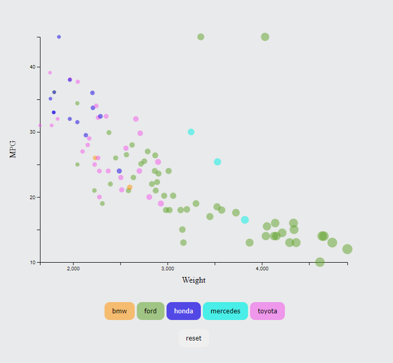
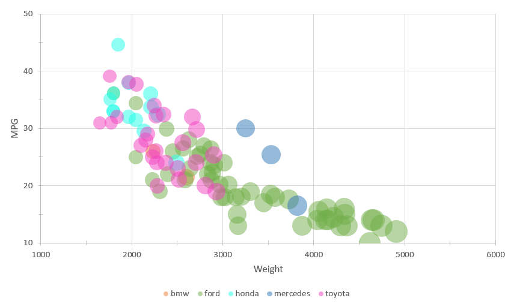
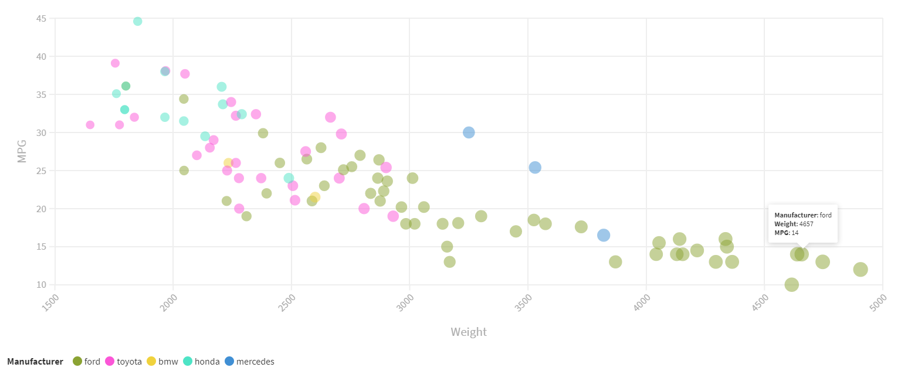
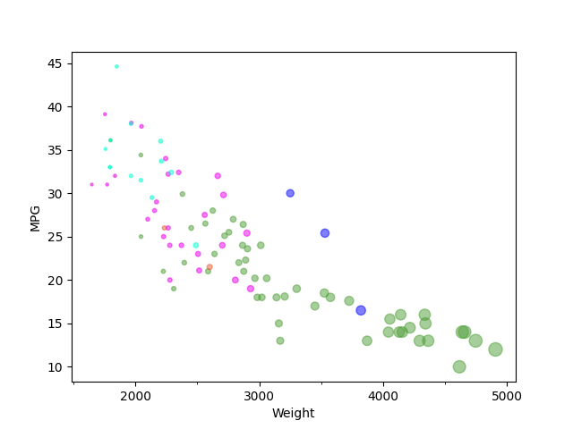
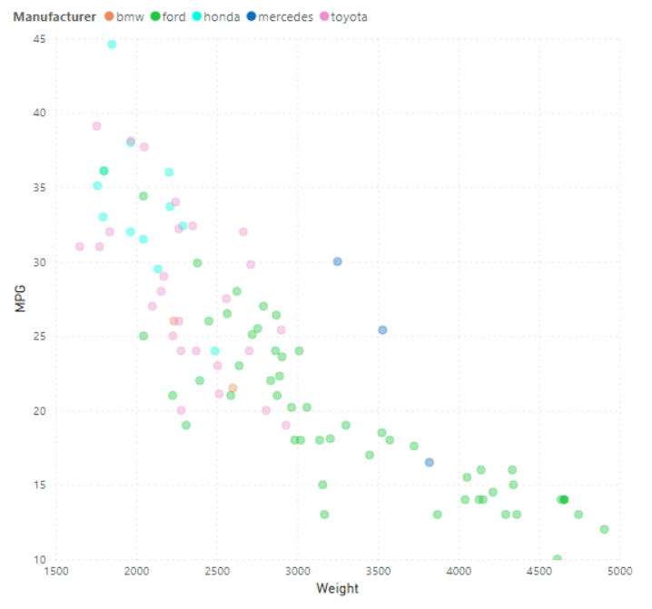
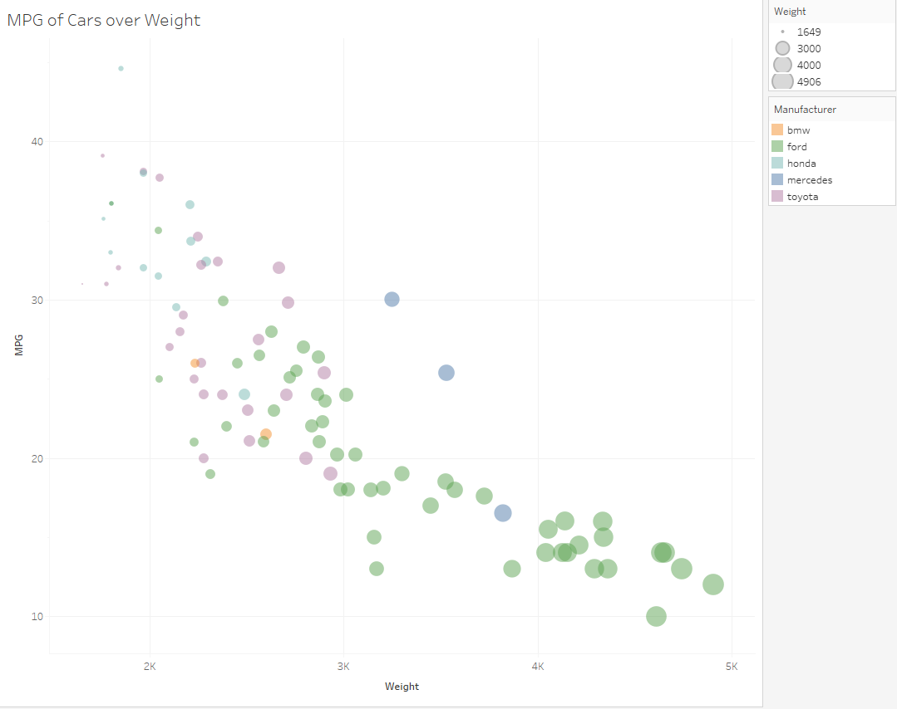
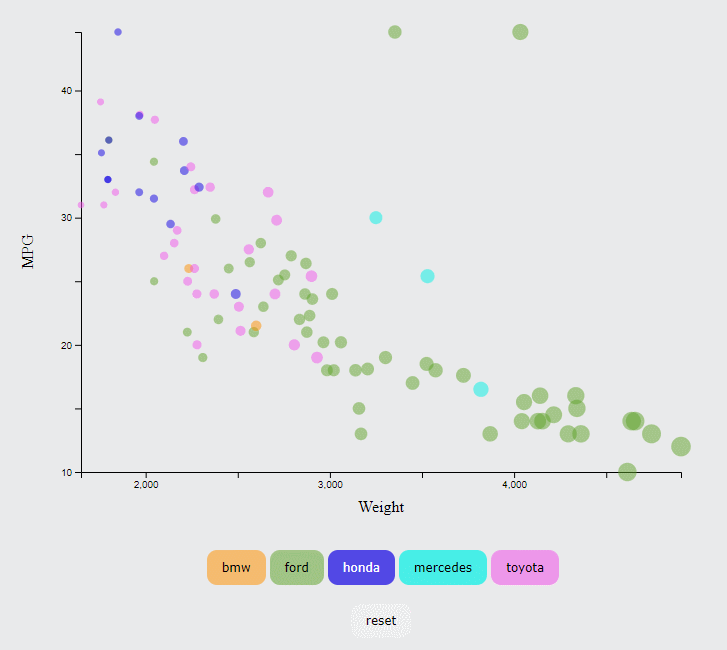

# 02-DataVis-7ways

Assignment 2 - Data Visualization, 7 Ways  
===

# Javascript + d3.js

Javascript is a programming language used to make web pages interactive. D3.js is a JavaScript library used for creating dynamic and interactive data visualizations. This approach is more work because you have to create all the elements. d3.js binds data to create each of the individual shapes and data points for the visual. It is a harder method to go about data visualization but it allows for a lot of possibilities in terms of customization compared to other methods. I enjoyed using it, but mostly because we've been learning it and it is really customizable.

# Excel

Microsoft Excel is a software program that uses spreadsheets to perform functions and formulas for data analysis. To create the visual, the values of the scatter plot are assigned to specific cells of the spreadsheet. I had originally started with a scatter plot and had a hard time trying to figure out how to change the size of the points until I realized there was a bubble chart. Overall, if I had known about the bubble chart from the beginning, I wouldn't say it was super hard. I did have to create new columns to differentiate the categories, which in other programs, could be done automatically. Another concern I had was the sizing of the cirlces is hard to differentiate. It is very limited in terms of interaction and customization, but I would recommend this to someone who is more focuses on manipulating the data and only needs a basic visualization.

# Flourish

Flourish is an online application used for data visualization. To create the visual, I simply indicated which column corresponded with a specific piece of data (x values, y values, etc). This was the first visual I started with and I found the platform surprisingly simple and easy to use. This would be great to use if I needed a quick visual that looks good. It also allows you to click on the legend to only show the corresponding points and hover over points for more details. Also, because it's online, it is very convenient not having to download any extra software. My only concern with this Flourish visual is the sizing of the points is hard to distinguish.

# Python + matplotlib + pandas

Python is a popular high-level programming language. matplotlib is a Python library for creazting visualizations, and pandas is also a Python library but for data manipulation and analysis. To create the visual, pandas is used to read in the csv and after assigning different variables to different values of the csv, matplotlib takes in that data and creates the visual. I was trying to create major and minor ticks to match the orginal picture, but only the x-axis seemed to work. I'm not exactly sure why, but that was the most frustrating part. For sizing the different points, that was a bit complicated as well because I was unsure what formula I should use. Even though it is a bit more customizable than other applications, the output is not the prettiest. I did like how the figure let you zoom in on data and move around the graph. I feel like there are better softwares and languages to use rather than Python that are either easier to use and/or produce a more visually-appealing output.

# Power Bi

Power Bi is a software program by Microsoft used for business intelligence and data visualization. It has a drag-and-drop interface to assign the data to teh different aspects of the graph. It wasn't too bad to figure out because I had used Tableau before this. The only trouble I had was the MPG column. Because it had "NA"s, the column was saved as text rather than a decimal. The interface was a bit difficult for me to navigate through but eventually I converted the format. In addition, I could not size the points to the weight. There is the option, however when I assigned weight to the size, it wouldn't give each point it's individual values. The data represented a summarization such as the median or count. There is usually an option to not summarize the data, however, the right dropdown table didn't have that option in that specific case. I was able to not summarize all the other data, but I'm not entirely sure why that did not work. I don't particularly like this application as much as others, but I could see people using it. Generally speaking, I don't think I would recommend this first for data visualization.

# R + ggplot2 + tidyverse

R is a programming language for statistcal computing and graphics. ggplot2 is a data visualization pagacke for R. tidyverse is a collection of R packages designed for data science. Once the csv is loaded, the data is loaded using ggplot(), and geom_point() is used to customize the data points. I've done a little bit of R, but because I'm not super experienced with it, I thought it would be more complicated. However, I was wrong and this method was super simple. I would definetly recommend this to people with some code experience and needs a visualization or general data analysis. 

# Tableau

Tableau is a software program that is used for business intelligence and data visualization. I have never used a software like this before, so it was a bit confusing at first. It uses a drag-and-drop interface to asign the data. Once I realized that, it was relatively simple. It is very similar to Power Bi, however I liked this way more. I've seen other visualizations made with Tableau that are really interesting, and shows how customizable it is. I would definetly recommend this anyone looking to make something pretty and interactive, without the need to code. 

## Technical Achievements

- **Hover for ToolTip**: Using D3.js, I implemented a tooltip to show the exact weight and MPG of each point. This was mainly so the points with "NA" as an MPG could be indicated.

- **Interactive Legend**: By clicking on the different buttons on the legend, it only shows the corresponding data points and can be reset with the "reset" button. 

## Design Achievements
- **Consistent Colors Throughout**: Throughout all the different visualizations, I kept the same color pallete for each.
- **Corresponding Colors in Legend**: In my D3 visual, I colored the buttons to act both a legend and still maintain their functionality.
- **Button Animations and Color Changes**: The buttons in the D3 visual change to a darker color when hovered over and also moves slightly when activated to indicate to the user what they're doing.
- **Enlarging Points**: When hovering over a point in the D3 visual, the point will slightly enlarge itself to show that it is being selected.
