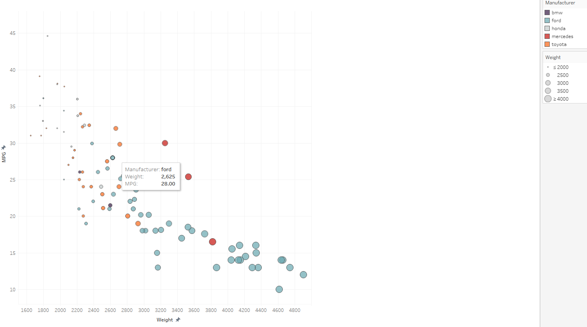
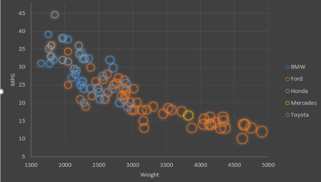

# 02-DataVis-7ways
Matthew St Louis

1. [02-DataVis-7ways](#02-datavis-7ways)
2. [Assignment 2 - Data Visualization, 7 Ways](#assignment-2---data-visualization-7-ways)
   1. [Libraries, Tools, Languages](#libraries-tools-languages)
   2. [Tips](#tips)
   3. [Readme Requirements](#readme-requirements)
   4. [Other Requirements](#other-requirements)
   5. [GitHub Details](#github-details)
   6. [Grading](#grading)
3. [R + ggplot2 + R Markdown](#r--ggplot2--r-markdown)
4. [d3...](#d3)
   1. [Technical Achievements](#technical-achievements)
      1. [Design Achievements](#design-achievements)
   2. [D3](#d3-1)
   3. [matplotlib](#matplotlib)
   4. [ggplot2](#ggplot2)
   5. [Tableau](#tableau)
   6. [Flourish](#flourish)
   7. [Excel](#excel)
   8. [Chart.js](#chartjs)
   9. [Technical Achievements](#technical-achievements-1)
   10. [Design Achievements](#design-achievements-1)
   11. [Resources Used](#resources-used)
      1. [D3 (copied from A1)](#d3-copied-from-a1)
      2. [Matplotlib](#matplotlib-1)
      3. [R](#r)
      4. [Chart JS](#chart-js)

Assignment 2 - Data Visualization, 7 Ways  
===

Now that you have successfully made a "visualization" of shapes and lines using d3, your next assignment is to successfully make a *actual visualization*... 7 times. 

The goal of this project is to gain experience with as many data visualization libraries, languages, and tools as possible.

I have provided a small dataset about cars, `cars-sample.csv`.
Each row contains a car and several variables about it, including miles-per-gallon, manufacturer, and more.

Your goal is to use 7 different tools to make the following chart:

These features should be preserved as much as possible in your replication:

- Data positioning: it should be a downward-trending scatterplot as shown.  Weight should be on the x-axis and MPG on the y-axis.
- Scales: Note the scales do not start at 0.
- Axis ticks and labels: both axes are labeled and there are tick marks at 10, 20, 30, etcetera.
- Color mapping to Manufacturer.
- Size mapping to Weight.
- Opacity of circles set to 0.5 or 50%.

Other features are not required. This includes:

- The background grid.
- The legends.

Note that some software packages will make it **impossible** to perfectly preserve the above requirements. 
Be sure to note where these deviate.

Improvements are also welcome as part of Technical and Design achievements.

Libraries, Tools, Languages
---

You are required to use 7 different tools or libraries.
Of the 7 tools, you must use at least 3 libraries (libraries require code of some kind).
This could be `Python, R, Javascript`, or `Java, Javascript, Matlab` or any other combination.
Dedicated tools (i.e. Excel) do not count towards the language requirement.

Otherwise, you should seek tools and libraries to fill out your 7.

Below are a few ideas. Do not limit yourself to this list!
Some may be difficult choices, like Matlab or SPSS, which require large installations, licenses, and occasionally difficult UIs.

I have marked a few that are strongly suggested.

- R + ggplot2 `<- definitely worth trying`
- Excel
- d3 `<- since the rest of the class uses this, we're requiring it`
- Matplotlib
- three.js `<- well, it's a 3d library. not really recommended, but could be "interesting"`
- p5js `<- good for playing around. not really a chart lib`
- Tableau
- Java 2d
- GNUplot
- Vega-lite <- `<- recently much better. look for the high level js implementations`
- Flourish <- `<- popular last year`
- PowerBI
- SPSS

You may write everything from scratch, or start with demo programs from books or the web. 
If you do start with code that you found, please identify the source of the code in your README and, most importantly, make non-trivial changes to the code to make it your own so you really learn what you're doing. 

Tips
---

- If you're using d3, key to this assignment is knowing how to load data.
You will likely use the [`d3.json` or `d3.csv` functions](https://github.com/mbostock/d3/wiki/Requests) to load the data you found.
Beware that these functions are *asynchronous*, meaning it's possible to "build" an empty visualization before the data actually loads.

- *For web languages like d3* Don't forget to run a local webserver when you're debugging.
See this [ebook](http://chimera.labs.oreilly.com/books/1230000000345/ch04.html#_setting_up_a_web_server) if you're stuck.

Readme Requirements
---

A good readme with screenshots and structured documentation is required for this project. 
It should be possible to scroll through your readme to get an overview of all the tools and visualizations you produced.

- Each visualization should start with a top-level heading (e.g. `# d3`)
- Each visualization should include a screenshot. Put these in an `img` folder and link through the readme (markdown command: ``.
- Write a paragraph for each visualization tool you use. What was easy? Difficult? Where could you see the tool being useful in the future? Did you have to use any hacks or data manipulation to get the right chart?

Other Requirements
---

1. Your code should be forked from the GitHub repo.
2. Place all code, Excel sheets, etcetera in a named folder. For example, `r-ggplot, matlab, mathematica, excel` and so on.
3. Your writeup (readme.md in the repo) should also contain the following:

- Description of the Technical achievements you attempted with this visualization.
  - Some ideas include interaction, such as mousing over to see more detail about the point selected.
- Description of the Design achievements you attempted with this visualization.
  - Some ideas include consistent color choice, font choice, element size (e.g. the size of the circles).

GitHub Details
---

- Fork the GitHub Repository. You now have a copy associated with your username.
- Make changes to fulfill the project requirements. 
- To submit, make a [Pull Request](https://help.github.com/articles/using-pull-requests/) on the original repository.

Grading
---

Grades on a 120 point scale. 
24 points will be based on your Technical and Design achievements, as explained in your readme. 

Make sure you include the files necessary to reproduce your plots.
You should structure these in folders if helpful.
We will choose some at random to run and test.

**NOTE: THE BELOW IS A SAMPLE ENTRY TO GET YOU STARTED ON YOUR README. YOU MAY DELETE THE ABOVE.**

# R + ggplot2 + R Markdown

R is a language primarily focused on statistical computing.
ggplot2 is a popular library for charting in R.
R Markdown is a document format that compiles to HTML or PDF and allows you to include the output of R code directly in the document.

To visualized the cars dataset, I made use of ggplot2's `geom_point()` layer, with aesthetics functions for the color and size.

While it takes time to find the correct documentation, these functions made the effort creating this chart minimal.

# d3...

(And so on...)

## Technical Achievements
- **Proved P=NP**: Using a combination of...
- **Solved AI Forever**: ...

### Design Achievements
- **Re-vamped Apple's Design Philosophy**: As demonstrated in my colorscheme...

## D3

I started with D3 because I used it for the last project and I had some starting code to build on. D3 is definitely the most versatile library and seems to have the most potential for customization, though I definitely had a hard time with some parts of it.

I thought that it would be relatively easy to add onto this code, but some additions were unexpectedly difficult. I couldn't get axis labels to work right. I tried a good number of different stack overflow articles (I wish I'd saved them, but I only save the resources that end up working). My attempt at axis labels is shown below:

D3 is certainly powerful, but I find it very hard to work with, especially when I'm just starting out with it. The API feels secretive and unintuitive, and the fact that the developer is responsible for every individual element of the chart is daunting.

## matplotlib

The next library I attempted was matplotlib. It seems like it will be useful for making graphs on my MQP, and I wanted to get some experience with it. This was definitely my favorite library to work with. While not as flexible as d3, it felt a lot more usable to me. The fact that the API is split between a Matlab state machine and object-oriented design is a bit weird, but it's pretty easy to find how to add chart elements.

I've gotten reasonably familiar with Pandas, and so data manipulation felt by far the most natural with matplotlib. Everything felt really straightforward to me. I was able to replicate the axis labels, scales, and color key without much issue, though I didn't figure out how to add a legend for size.

## ggplot2

The third approach I applied was ggplot2. It was advertized as being able to set up in just a few lines of code, and that's exactly how it worked. I had some trouble with getting the sizes to show up on the legend. It was really interesting to me how I didn't need to do any data processing whatsoever.

## Tableau

Tableau was interesting to me because the fact that it's a drag-and-drop interface seems to imply that it's meant for non-technical users to be able to manipulate data easily, but the UI was so busy that it took me a while to figure out where to get started and how to display the data correctly. For some reason, the data was originally trapped in aggregations, and it took me a bit to get it to show up as individual points.

Once I had the graph displayed, I could customize it fairly easily and started to explore the UI, but the whole experience felt pretty unintuitive to me.

One problem I had with Tableau is that the color customization was very limited. I couldn't figure out how to use any custom colors outside of the provided pallets, so I went with the colorblind-friendly pallet.

Overall, I get the sense that Tableau is functional but very rigid in what customization it allows. It doesn't feel flexible enough for me to enjoy.

## Flourish

Flourish was similar to Tableau in its simple, non-technical design, but I found it a lot more readily usable. The design were you provide columns to different encodings felt extraordinarily straightforward. It also feels more customizable than Tableau because I was able to customize the colors.

I would probably prefer Tableau if I had to work with one for a long project, but for something quick, easy, and customizable, Flourish feels more friendly to me.

## Excel

Most of my experience with Excel has been high school physics graphs. Those felt pretty straightforward, so I assumed that this would be straightforward as well, and I thought that this would be as well. I was very mistaken.

I was surprised that Excel gave me the most trouble with data preparation—even more than Chart.js. I couldn't find a straightforward way to separate out the different series. There's probably a complicated way to it with obscure formulas or some pivot table nonsense, but I ended up making the data into a table, sorting the table by Manufacturer, and manually selecting each make of car as a separate series.

Excel is interesting in how it's by far the least user-friendly of the non-technical approaches. I know that it's meant to be usable for business majors, but it feels like it takes a lot of precise finnegaling to do anything interesting.

One small difficulty I ran into was that hte dots for BMW were obscured by the colors on top of them and indistinguishable from the Honda purple dots. I had to move the BMW below the other series so that it would be plotted last so it would be on top and visible.

For all of the trouble it takes to make an interesting graph, the result is not that impressive. I feel like I'll avoid Excel unless I need to make the simplest of graphs. I think that I would rather use matplotlib in most situations of medium complexity.

## Chart.js

Chart JS was the last approach I used. I found it really interesting how much interactivity this graph came with out of the box. You can click on different colors on the legend to exclude them from the graph, and the graph will automatically rescale to fit the remaining data.

I had some trouble figuring out how to format the data from the documentation. I found it really annoying how every property to set takes an object with very specific attribute names. I tried to replicate the format shown on the Bubbles documentation page, but I needed to read several other pages to piece together the expected format of the data. Once I had that figured out, it was relatively straightforward to stylize the graph and further manipulate the data.

Once I learned to use the ChartJS API, I liked it a lot more than the d3 API. d3 always feels like cryptic incantations into the void to me. I don't understand what strings are arbitrary and which have special meaning. Looking up syntax in d3 feels like finding something I would have had no way to know about, and I need to figure out where it fits into the code I've written. With ChartJS, it feels a lot more natural where the pieces fit together, and VS Code's intellisense lets me find some settings on my own without the documentation. 

I think I prefer working with ChartJS's API to d3's, though the fact that there's so much interactivity built into what comes out of the box makes it feel less flexible than d3. Since everything in d3 needs to be added manually, it feels like the most versatile of any approach I used.

## Technical Achievements

## Design Achievements

For this assignment, I wanted to play around with a few of the color tools shown in class. For most visualizations ([d3](#d3), [matplotlib](#matplotlib), [chart.js](#chartjs)), I used the [Adobe Color Wheel](https://color.adobe.com/create/color-wheel) on Double Split Complementary because this felt conducive to categorical data to me. 

For [Excel](#excel), I tried out the [colorblind-friendly tools on the Adobe Color Wheel](https://color.adobe.com/create/color-accessibility) to come up with the following pallet.

For Tableau, I couldn't figure out custom colors, so I used their colorblind-friendly pallet, though in my opinion it doesn't make the colors distinct enough. 

For my chart with [Flourish](#flourish), I tried using [colorgorical](http://vrl.cs.brown.edu/color) to create a distinct color pallet. I had to try a few different times before the colors actually looked distinct on the graph to me.

## Resources Used
- [Gitignore](https://www.toptal.com/developers/gitignore/api/node,macos,windows,vscode,linux)
- [Glitch Hello Express](https://glitch.com/edit/#!/hello-express)
  - Express server template
  - HTML Page Template
- [Stack Overflow](https://stackoverflow.com/questions/58384179/syntaxerror-cannot-use-import-statement-outside-a-module)
  - Getting the import to work

### D3 (copied from [A1](https://github.com/mastlouis/01-ghd3))
- [Observable - Learn D3 Data](https://observablehq.com/@d3/learn-d3-data?collection=@d3/learn-d3): I used this to learn how to parse dates in D3 so that the wind data could have a meaningful X coordinate.
- [D3 Graph Gallery Scatterplot](https://www.d3-graph-gallery.com/graph/scatter_basic.html): Used as an example to get circle working
- [D3.js Version 5 Scatterplots with Shapes](https://chewett.co.uk/blog/1483/d3-js-version-5-scatterplot-with-shapes/): Used to get symbols to work
- [D3 in Depth - Shapes](https://www.d3indepth.com/shapes/): Used as a reference for different symbol types

### Matplotlib
- [Python Venv help](https://www.studytonight.com/post/python-virtual-environment-setup-on-mac-osx-easiest-way): I got stuck in venv hell, and this got me out.
- [Matplotlib Example](https://matplotlib.org/stable/gallery/lines_bars_and_markers/scatter_with_legend.html): This example of a scatterplot with a legend is mostly what I based my code on.
- [Save Image](https://muddoo.com/tutorials/matplotlib-save-plot-to-file-in-png-or-jpg-format/)
- [What Axis Does](https://matplotlib.org/stable/api/axes_api.html#matplotlib.axes.Axes): The API took a bit of figuring out, and this definitely helped.
- [Documentation](https://matplotlib.org/stable/api/index.html): I read over some of the documentation to better understand the two parallel API's and how different pieces of the API fit together.

### R
- [Import CSV](https://www.statology.org/import-csv-into-r/)

### Chart JS
- [Documentation](https://www.chartjs.org/docs/latest/getting-started/usage.html): I learned the API by reading the documentation and copied off of their general example and Bubbles example.
- [CDN](https://cdnjs.com/libraries/Chart.js)
- [Labeling Axes](https://www.chartjs.org/docs/latest/axes/labelling.html)