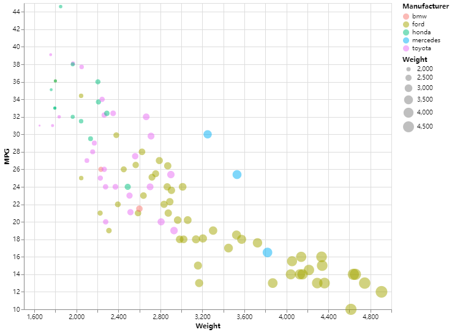
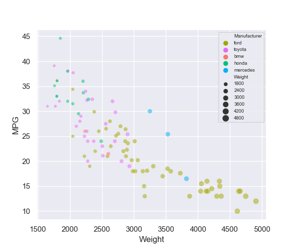

# 02-DataVis-7ways

Assignment 2 - Data Visualization, 7 Ways  
===

I have visualized given data set in 10 ways. These features are totally preserved in my replication:

- Data positioning: it should be a downward-trending scatterplot as shown. Weight should be on the x-axis and MPG on the y-axis.

- Scales: Note the scales do not start at 0.

- Axis ticks and labels: both axes are labeled and there are tick marks at 10, 20, 30, etcetera.

- Color mapping to Manufacturer.

- Size mapping to Weight.

- Opacity of circles set to 0.5 or 50%.

- Grid.

Furthermore, legends and background color are preserved in most replications.

Libraries, Tools, Languages
---

The libraries, tools and languages I've used are as follows.

7 libraries and 3 languages: 

- ggplot2 + R + R Markdown
- d3 + JavaScript
- Vega-lite + JavaScirpt + JSON
- Matplotlib + mpld3 + Python
- Seaborn + Python
- Bokeh + Python

4 tools:

- Tableau
- Flourish
- PowerBI
- Google sheet

Catalog
---
[1. R + ggplot2 + R Markdown](https://github.com/Junying-Li/02-datavis-7ways/blob/main/README.md#1-r--ggplot2--r-markdown)

[2. d3 + Javascript](https://github.com/Junying-Li/02-datavis-7ways#2-d3--javascript)

[3. Vega-lite + JavaScirpt + JSON](https://github.com/Junying-Li/02-datavis-7ways#3-vega-lite--javascirpt--json)

[4. Matplotlib + mpld3+ Python](https://github.com/Junying-Li/02-datavis-7ways#4-matplotlib--mpld3-python)

[5. Seaborn + Python](https://github.com/Junying-Li/02-datavis-7ways#5-seaborn--python)

[6. Bokeh + Python](https://github.com/Junying-Li/02-datavis-7ways#6-bokeh--python)

[7. Tableau](https://github.com/Junying-Li/02-datavis-7ways#7-tableau)

[8. Flourish](https://github.com/Junying-Li/02-datavis-7ways#8-flourish)

[9. PowerBI](https://github.com/Junying-Li/02-datavis-7ways#9-powerbi)

[10. Google sheet](https://github.com/Junying-Li/02-datavis-7ways#10-google-sheet)

# 1. R + ggplot2 + R Markdown

Page link: https://junying-li.github.io/02-datavis-7ways/ggplot2/index.html

R is a language primarily focused on statistical computing.
ggplot2 is a popular library for charting in R.
R Markdown is a document format that compiles to HTML or PDF and allows you to include the output of R code directly in the document.

To visualized the cars dataset, I made use of ggplot2's `geom_point()` layer, with aesthetics functions for the color and size.

While it takes time to find the correct documentation, these functions made the effort creating this chart minimal.

[Return to catalog](https://github.com/Junying-Li/02-datavis-7ways/blob/main/README.md#catalog)

# 2. d3 + Javascript

Page link: https://junying-li.github.io/02-datavis-7ways/d3/index.html

D3.js is a JavaScript library for manipulating documents based on data. 

There are 2 problems in our data set. First one is some columns in 'MPG' are NaN values. Second one is the type of values in our data set is string, we need to convert them into integer before visualizing.

To solve the first problem, I defined a filter function and made use of `data.filter()` to remove columns with NaN value. 

For the second problem, I made use of `+` to convert string into integer. For instance, `d.Weight = +d.Weight;`.

I also set up background color and grid to make it looks like the given picture more.

In d3, we need to handle with every elements by our own. It has the longest code in all of my 10 ways to visualize. But on the other hand, it's also more flexible. We can do much more things in different ways. 

[Return to catalog](https://github.com/Junying-Li/02-datavis-7ways/blob/main/README.md#catalog)

# 3. Vega-lite + JavaScirpt + JSON

Page link: https://junying-li.github.io/02-datavis-7ways/Vega-Lite/index.html

Vega-Lite is a high-level grammar of interactive graphics. It provides a concise, declarative JSON syntax to create an expressive range of visualizations for data analysis and presentation.

Vega-Lite has an online editor, which is very convenient to write JSON and also run it. We can also embed the JSON to html by using `vegaEmbed()`. I provided both JSON file and html file. 

It's very easy to visualize data with Vega-Lite. We just need to put data into its JSON syntax, then we will get a nice visualization. In addition, it can filter invalid values and set legends as well as grid automatically, which saved a lot of time.

[Return to catalog](https://github.com/Junying-Li/02-datavis-7ways/blob/main/README.md#catalog)

# 4. Matplotlib + mpld3+ Python
## 4.1 Plotted by Matplotlib

Page link: https://junying-li.github.io/02-datavis-7ways/matplotlib/index.html

Matplotlib is a plotting library for the Python programming language and its numerical mathematics extension NumPy. It provides an object-oriented API for embedding plots into applications using general-purpose GUI toolkits like Tkinter, wxPython, Qt, or GTK+.

I use `pandas.read_csv()` to load data. Then made use of `notNull()` to filter data and remove columns with NaN value. I also use `map()` to convert 'Weight' and 'MPG' data values from string to integer. When it comes to axes and grid, I made use of `plt.rcParams[]` to set. Finally, I use `plt.scatter()` to plot, and `plt.show()` to show result.

The pro of matplotlib is it has very powerful function of plotting and can be combined with data analysis. The con of matplotlib is that we can't export results to web page directly, so I think it's not very suitable for web based visualization development.

[Return to catalog](https://github.com/Junying-Li/02-datavis-7ways/blob/main/README.md#catalog)

## 4.2 Exported by mpld3

Page link: https://junying-li.github.io/02-datavis-7ways/Mpld3/index.html

To solve the export problem mentioned above. I made use of another library, mpld3.

The mpld3 project brings together Matplotlib and D3js. It can export your matplotlib graphics to HTML code which can be used within the browser, within standard web pages, blogs, or tools such as the IPython notebook. Graphics Exported by Mpld3 have tools below when mouse over it. Tools include box zoom, pan, and reset.

By using `mpld3.show()` can run a local server to show graphics on web page. I also use `mpld3.save_to_html()` to save graphics in html, which is [Mpld3/index.html](https://junying-li.github.io/02-datavis-7ways/Mpld3/index.html).

[Return to catalog](https://github.com/Junying-Li/02-datavis-7ways/blob/main/README.md#catalog)

# 5. Seaborn + Python

Page link: https://junying-li.github.io/02-datavis-7ways/seaborn/index.html

Seaborn is a Python data visualization library based on matplotlib. It provides a high-level interface for drawing attractive and informative statistical graphics. I made use of `seaborn.scatterplot()` to plot graphics.

Both as visualization librarys, seaborn is much easier to use than matplotlib. It can filter invalid data, draw legends, set grid as well as background automatically. It's even more comvenient than Vega-Lite. But we still need to import matplotlib while we use seaborn to plot, since we will use `plt.show()` to show result.

[Return to catalog](https://github.com/Junying-Li/02-datavis-7ways/blob/main/README.md#catalog)

# 6. Bokeh + Python

Page link: https://junying-li.github.io/02-datavis-7ways/bokeh/index.html

Bokeh is a Python library for creating interactive visualizations for modern web browsers. It helps you build beautiful graphics, ranging from simple plots to complex dashboards with streaming datasets. With Bokeh, you can create JavaScript-powered visualizations without writing any JavaScript yourself.

Bokeh is very convenient to use too, meanwhile, it's surprisingly easy to create html by it. Whatsmore, the graphic exported to html has a tool bar beside it. Tools include pan, box zoom, wheel zoom, save and reset.

We can simply use `output_file("name.html")` to export our graphics to html. Furthermore, bokeh can draw legends automatically as long as we have defined `legend_group`. I made use of `factor_cmap()` to set color mapping to Manufacturer, `LinearInterpolator()` to set size linear mapping to Weight.

[Return to catalog](https://github.com/Junying-Li/02-datavis-7ways/blob/main/README.md#catalog)

# 7. Tableau

Page link: 

Tableau Online (might need access): https://prod-useast-b.online.tableau.com/t/jli/views/A2tableau/A2-Tableau?:showAppBanner=false&:display_count=n&:showVizHome=n&:origin=viz_share_link

Embeded page: https://junying-li.github.io/02-datavis-7ways/Tableau/index.html

Tableau is a powerful and fastest growing data visualization tool used in the Business Intelligence Industry. It helps in simplifying raw data in a very easily understandable format. Tableau helps create the data that can be understood by professionals at any level in an organization. It also allows non-technical users to create customized dashboards.

Tableau provides desktop application, online editor, and server, etc. It's basically perfect for the non-technical users who want to visualize data, besides they need to pay for access. 

[Return to catalog](https://github.com/Junying-Li/02-datavis-7ways/blob/main/README.md#catalog)

# 8. Flourish

Page link: https://junying-li.github.io/02-datavis-7ways/Flourish/index.html

Flourish is an online data visualization tool. It's more easy to use than Tableau, and most importantly, it's free. For individuals, Flourish is good enough. But for companies and organizations, Tableau is better.

[Return to catalog](https://github.com/Junying-Li/02-datavis-7ways/blob/main/README.md#catalog)

# 9. PowerBI

Power BI is a business analytics service by Microsoft. It aims to provide interactive visualizations and business intelligence capabilities with an interface simple enough for end users to create their own reports and dashboards. 

PowerBI is free to use and does what it should as a data visualization tool. But publish work to internet needs Microsoft access. It seems that PowerBI was designed for companies and organizations, because individuals are not allowed to get access. 

[Return to catalog](https://github.com/Junying-Li/02-datavis-7ways/blob/main/README.md#catalog)

# 10. Google sheet

Page link: https://junying-li.github.io/02-datavis-7ways/Google%20sheet/index.html

Google Sheets is a spreadsheet program included as part of the free, web-based Google Docs Editors suite offered by Google. It's like an online version of Excel, but much better than Excel in data visualization. 

[Return to catalog](https://github.com/Junying-Li/02-datavis-7ways/blob/main/README.md#catalog)

## Technical Achievements
- **Used 10 ways to visualize**: I used 10 ways to visualize given data set and each one meets the requirements. 3 languages (R, JavaScript, Python), 7 libraries (bokeh, ggplot2, matplotlib, mpld3, seaborn, vega-lite, d3) are used in my solutions. And I also made use of R markdown, JSON, and html. Besides, I chose 4 popular data visualization tools to draw graphics too. 
- **Filtered Data**: In d3,js and Python, I use different ways to filter data and remove clumns with NaN value.

## Design Achievements
- **Color map**: I made color maps or palettes for each way in this assignment to make sure they look like the graphic given by the professor.
- **Weight linear map**: In some ways of this assignment, the circles became too big after mapping to Weight. To make sure we have a better view, I set and adjusted parameters of linear mapping.
