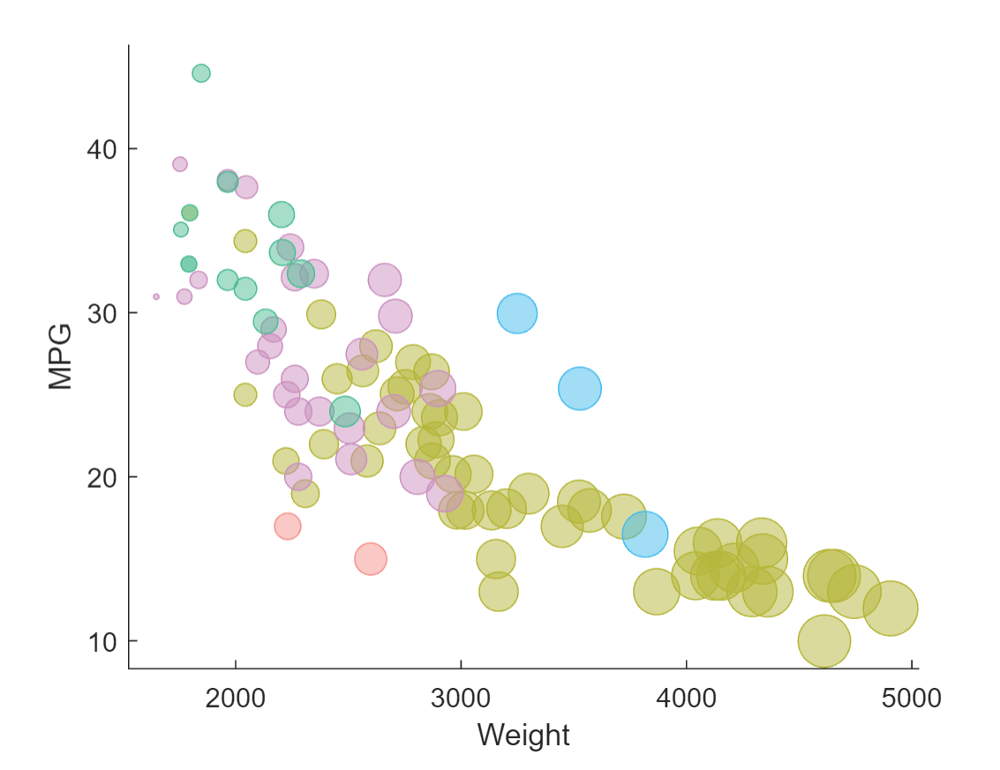

# 02-DataVis-7ways Gabrielle Acquista

Assignment 2 - Data Visualization, 7 Ways  
===

My goal is to use 7 different tools to make the following chart:

# R + ggplot

R is a language primarily focused on statistical computing and graphics.
For this recreation I used ggplot2 which is a popular library for charting  in R. 
This tool was incredibly simple to use and my result was essentially a replica of the original.
All I had to do was open the ggplot2 library, read the data, and plot it! 
I used geom_point to change the opacity of the points but R makes that so easy there wasn't even the need for an extra line of code.

I can see R being useful in situations where you want to make a nice plot from data but don't necessarily want to put in extra time to customize it. 
It's also a good learning tool if you want to begin programming with data, but don't have a lot of experience with code. 

All features were preserved.

The final product:

# d3

D3 is a JavaScript library used for making interactive data visualizations, which is exactly what I did.
This was the first tool I decided to use for the assignment and it did not go well. I spent about 4 days trying to load the data and have anything show up on 
my local browser. Fortunately I discovered that I needed to load the raw data rather than my local file and things started coming together. 
This tool is very useful for in-depth customization and there was a lot more opportunity for interaction with the plot.
Overall I really like how it turned out and with this one I added a little bit of my own twist to the code (see Technical Acheivement).

I used the D3 graph gallery for starter code and all (required) features were preserved. 
I attempted the white major gridlines with a grey background, but the minor gridlines were  a little too complicated.

The final product:

# python + Matplotlib 

As a CS major who has never used Python, this plot was tricky, especially just getting started with downloading packages. 
The hardest part was downloading the correct versions and setting the axis values, but upon discovery of plt.MultipleLocator I was able to do what I wanted with the graph.
To be honest I don't think I would ever choose to use python again. 
It might be useful for a beginner programmer, but ultimately this library and entire process just made me upset.
It seemed just as tedious to do things that were required for the replication as it was to incorporate extra designs with other libraries and tools.

I found starter code at https://towardsdatascience.com/one-bubble-chart-comparing-9-data-visualization-tools-7308b893950a .
All (required) features were preserved. 

The final product!

# Tableau

Tableau was so fun! I really enjoyed the set up of the software, it was very easy to essentially "click and drag" exactly what I wanted and where.
Because of how the data sample was given to us, Tableau made it very difficult to separate each car.
To get around this issue I added a column to the data that assigned each car a unique number 1-95. 
This made it possible to map each car individually and preserve all required features!
I see tableau being useful if your data set is very structured, or if you want to present the same data in multiple ways. 
It was nice because the program could plot the SUM, AVERAGE, COUNT, among many more options. I would love to use this tool again.

The final product!

# Excel

Excel was much harder than I anticipated. Excel is great for a lot of things regarding statistics and making simple charts, but I wouldn't use this again for something fun and exciting in data vis. 
It's a great tool for spreadsheets and organizing data, but I don't foresee it being especially useful for complex vis designs.
I tried separating the data within the plot itself but eventually found it was much easier to separate the data by manufacturer and plot the different categories on the same graph. 
Along with that data hack I also had to create another "fake" data column that was a single point with a really really large bubble size that had no fill. 
This helped me shrink all of the other data points so the car dots were clear.
Once I did that I was able to customize color and map size to weight. While I was able to replicate most aspects, I was not able to  get rid of the minimum values on the axis.
I have the origin point not starting at 0, however the minimum 1000 for x-axis and 0 for y-axis are still shown on the plot. 

The final product!

# Flourish

Flourish was fun and simple! I loved how easy it was to drag and drop your data, and then just fill in which row/column you wanted and where. 
It was also very easy to customize and the layout really helpful.
I was able to recreate everything necessary except the scales. I was able to avoid starting the axis at 0, but I deviated in showing the correct tick marks.
Although there were lots of options and areas for customization, the charts was limited to just that, whatever the options were. 
It's a good tool for making a quick, nice-looking vis, but it's not ideal when it comes to the potential of immense customization.

The final product!

# Matlab

I had a very difficult time with Matlab, from syntax to weird data loading. 
My main focus with Matlab was trying to use "gramm" as a path, which is a plotting tool made for Matlab, inspired by ggplot2 in R, located here: https://github.com/piermorel/gramm . 
This did not work for me. I really tried, because I thought it would be a fun technical acheivement to use an extention of Matlab, but it was more trouble than it was worse because I was using the online version of Matlab. 
Once I figured out the logistics and realized I needed the same manipulated data as I did for excel, I still had problems. My csv file got corrupted among other fun obstacles. 
Thankfully, https://www.mathworks.com/help/examples.html helped me with learning how to program in Matlab, so I was able to recreate all required features.
I'm sure Matlab is very useful with a lot of development and analysis (especially with bio-vis) but I felt like it was a bit complicated if you wanted to create an interactive scatterplot.

The final product!

# SPSS

I can honestly say I never want to see SPSS again. I'm using this chart more for a design achievement because I wanted to try it and compare to excel. 
It was horrible. I know it has a lot more useful tool than excel, but it gave me multiple unnecessary problems, like not saving and being incredibly difficult to follow.
This tool is definitely useful for professionals and complex data analysis, but for somebody who just wanted to make a bubble chart, it was not ideal. 
I'm still stunned that I could customize every color, but I couldn't change the transparency.

The final product!

# vega-lite

(See Technical achievements).
The final product!

## Technical Achievements
- **Vega-Lite** This was a fun technical experience! I really loved learning vega-lite and seeing the usability of this tool. I even dove into the compiler code to see what was under the surface of my code and try and change the bubbles to different colors, but fell short.
- **Matlab Attempts** As I previously mentioned, I looked into the extension gramm but ultimately found that Matlab could do everything I needed it to with it's own library.
- **D3 Mouseover** With two "technical fails" I decided to go back into my d3 code and add some fun interactivity to the bubbles on mouseover. I wanted the bubbles to "pop and disappear" so once all the cars have been hovered over, the plot was empty. If I had more time I would have added a label to mouseover.

### Design Achievements
- **RGB Colors**: As demonstrated in my colorscheme I used the original image to calculate RGB values, and make all of my plots the exact correct color (where this customization was possible).
- **SPSS**: I tackled an extra visualization because I wanted to explore the differences between excel and SPSS.

