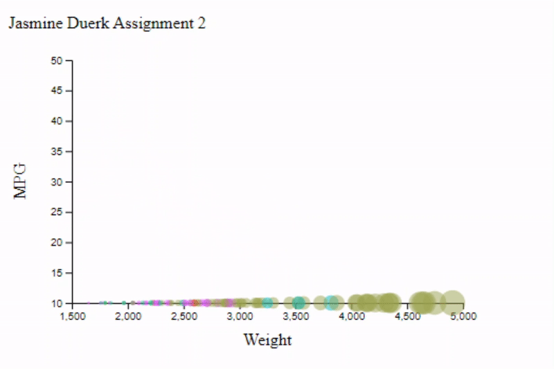

Assignment 2 - Data Visualization, 7 Ways  
===

# R + ggplot2 + Jupyter Notebook

R is a language primarily focused on statistical computing. ggplot2 is a popular library for charting in R. Jupyter Notebook allows a user to combine text with code, and run parts at a time, while properly displaying output graphics.

Although it was challenging at first to determine how to properly use geom_point() for customization (size and color), it ended up being extremely concise by the end. The code effectively ended up being 3 lines.

# d3
d3 is a library for Javascript that helps to create dynamic visualizations.

The syntax was very different from what I'm used to, which made it difficult to code in at first. However, I can see how there is immense potential for customization with this library. I referenced this code example for help creating the scatter plot: https://www.d3-graph-gallery.com/graph/scatter_basic.html.

# Python + Jupyter Notebook

Python is a popular language for software developers, and I have personally used it to do some work in AI and machine learning. Once again, I used Jupyter Notebook so that I could run portions of the code at a time and see the output graph. I used the Python Matplotlib library to create the visualization.

Even though I have experience using the language and Matplotlib, I still found it hard to customize the colors by manufacturer. I ended up having to group the dataframe by Manufacturer and plotting the points in a loop. Otherwise, it was easy to use, but slightly more verbose than R.

# Excel

Excel is used for creating and analyzing spreadsheets. 

Surprisingly, I probably struggled the most to create this one. I have little experience using Excel (I don't have it on my PC) so it took a lot of effort to determine how to properly customize the chart. Specifically, scaling the points by weight was tough because they ended up very large.

# Flourish

Flourish is an online data visualization platform.

I found this exceptionally easy to use. It was intuitive and probably took two minutes after the data was imported. It also has, by default, attractive animations and formatting. You can click on one of the dots in the legend and it will hide the points from the graph. However, I can see how this has less customization than other, more complex options.

# Tableau

Tableau is a data visualization software.

It was relatively easy to create the chart in Tableau, even without understanding most of the interface. I simply had to drag the columns into the Size and Color categories for the customization.

# Google Sheets

Google Sheets is an alternative to Excel, also used for creating and analyzing spreadsheets.

I found this very simple to use, mostly due to my experience with Sheets. That being said, I think the sizes of the circles are too big, and I could not figure out how to customize the scale properly to make them a more reasonable size.

## Technical Achievements
- **Animated d3 graph**: The points on the d3 graph animate into place. 

## Design Achievements
- **Graph Dark Mode**: Customized the font and colors for a more visually appealing design. Click the link for the graph with animation and all features. https://public.flourish.studio/visualisation/5355238/ (Hover on points for more information about each one. Click on the dots in the legend to show/hide specific manufacturer points.)

