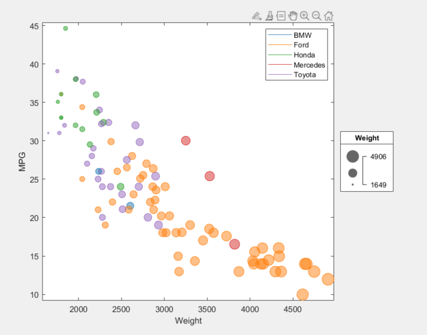
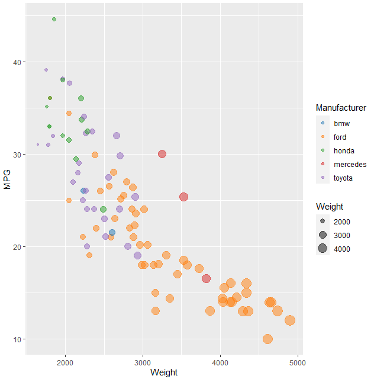
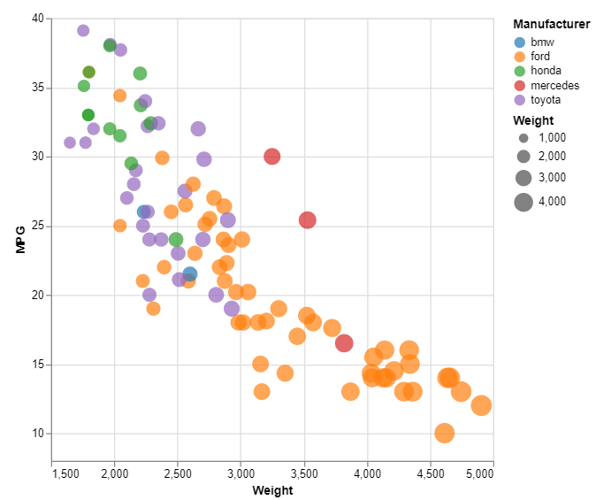
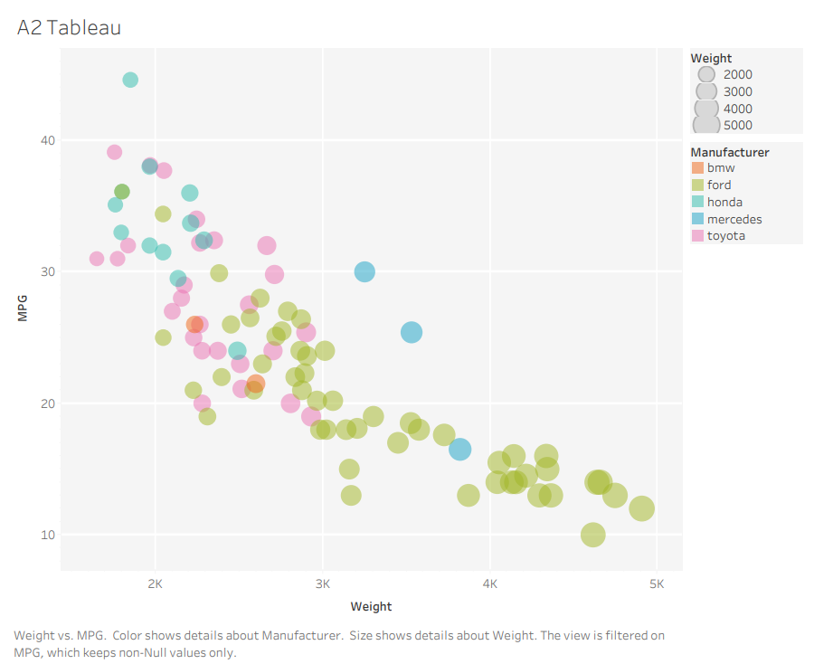

Assignment 2 - Data Visualization, 7 Ways  
===
#### By Andrew Nolan

For this assignment we are tasked with recreating the following graph using 7 different tools.


This graph was provided by Professor Harrison along with a cars dataset

For this project I chose the following 7 tools, I will discuss them in more detail in the sections below:
1. Microsoft Excel
2. MATLAB R2020B
3. R + ggplot2
4. Python + Matplotlib
5. d3
6. Vega-lite
7. Tableau 

## Excel


The first step on my journey into datavis was excel. Whenever I explore a new csv file this is usually my first step because I can quickly throw together a scatterplot or other visualization with minimal efforst. So I was very surprised to discover this would be the hardest tool to use. 

According to Wikipedia, Microsoft Excel is the industry standard spreatsheet application. It has come a long way since its original release in 1987 and now provides a lot of features for exploring data. Some of these features include basic visualization tools. Although it does support the use of Visual Basic (VBA) for writing full coded macros, I limited myself to only using standard Excel features for this project.

While it's great for simple visualizations, Excel does not do a great job at making complex graphs. It is strict in its requirement for the number of series affecting the data points. With a bubble chart it expects three values: x, y, and bubble size. To add a fourth value of color a lot of hacky maneuvers need to be taken [1]. For each different color/manufacturer type, I had to create a separate series and put the weight (x values) in that and #N/A values in the column for when it was not of that type. You can see a subset of this change in the data below. When a car was a Ford it's weight would go in the ford column and a #N/A value would go in the others. Then each of these would be plotted on the graph as different colors. The nice part of this is it allowed the color legend to be auto generated.


Another major draw back was there appears to be no built in way to add a weight legend to the Excel graph. Excel does support VBA scripts but I wanted to try to do everything purely with Excel. So for this legend I had to add a textbox and manually draw the weight cirles. It's tedious and not automated, but it doesn't look bad.

Excel took me a very long time to complete compared to some of the others. It's very limited in what it allows and doesn't allow much customization beyond their given features. I would not recommend Excel for fancy visualizations, but I would say it's a good choice for very simple, quick graphs like basic bar charts or 2 feature scatter plots.

## MATLAB R2020B


After graduating this Spring, I will begin working full time at MathWorks in late July. I thought it would be appropriate for me to try to create this graph in the tool I will be developing. 

MATLAB is a programming platform designed specifically for engineers and scientists [6]. Originally it focused specifically on Matrix operations (hence its name MATrix LABratory). It has come a long way and is now a popular programming language. Although, unfairly in my opinion, MATLAB is losing a lot of users to Python and it's various libraries recently. 

I think I am lucky to have taken this class when I did, because the latest release of MATLAB, version R2020B released in fall 2020, includes a new feature to easily generate bubble charts [7]! It took a little bit of time to refresh myself on MATLAB syntax and convert the Manufacturer data into the colors I wanted. But overall it was quick and easy to generate the graph. It was very nice that they added this built in bubble chart function. It even has a built in bubble legend! That made creating the main chart easy.

The only issue arose with creating the legend for the colors. MATLAB, like Excel, tries to treat the X axis as the series for the legend. This makes sense, but if you want to plot color, like in Excel, this meant I have to do something hacky. I plotted some dummy data points with no values but the appropriate colors so that I could create a correct color legend [8]. It would be nice to have a built in color legend function, maybe I'll make that a feature when I work there.

Another weird thing, MATLAB uses 0 to 1 for their RGB scale instead of 0 to 255, I found this confusing.

However, one nice bonus I wanted to point out is that MATLAB graphs have a lot of cool built in features. Without any additional code they include zoomimg, panning, saving/copying image, highlighting/selecting subsets of the data on the graph, inserting new data points, and many more things. It's a pretty nice feature to include all of these by default.


## R + ggplot2


R is a language focused on statistical computing and graphics. One of R's major goals is to provide easy to create, well-designed, publication quality plots. I would say they do a good job achieving this goal.

Before this class the only people I knew who used R were math majors. Math majors are very smart and it's kind of intimidating, so I thought I would never use R myself. But now here I am, having made a bubble chart in R, I can say I am no longer intimidated by it. It was actually super simple to code and it had nice documentation [10]. Creating a graph that matches the given target graph was very easy in R. There may be some slight bias there because R was used to make the original graph.

I had a little trouble getting my custom colors to work in R, but I found a YouTube tutorial that made it easy [12]. YouTube seems to have a lot of good R content. Another problem I had, was I could not figure out how to get the R script to run from it's location, it always ran from the IDE's file path, so I had to hardcode the location of the data csv file.

Overall, I was just very pleasantly surprised about how easy it was to learn and use R for data vis purposes.

## Python + matplotlib


To quote the matplotlib website "Matplotlib is a comprehensive library for creating static, animated, and interactive visualizations in Python" [16]. Everyone that has used Python has probably heard of this tool. When I was an SA for the CS 1004, the undergraduate intro to programming for non majors, I had to teach a lot of people how to use matplotlib. So I thought it would be another good tool for visualizing this scatterplot.

Whenever I have used matplotlib in the past I've found that it accomplishes 90% of my goals very easily and then some small feature is a challenge to implement. That was the case here too. Apparently, I'm not alone on this, on their own website they say the following "Matplotlib makes easy things easy and hard things possible" [16]. I completely agree.

The first steps were super easy, I loaded in my csv and I displayed it as a scatter plot with the color and bubble size and all. Displaying the plot once the data is loaded is one line of code:
```
plt.scatter(Weight, MPG, s=BubbleWeight, c=Manufacturer, alpha=0.5)
```
This is simlar to R. R also used only one line to generate the plot. The difference is matplotlib did not automatically generate the legends. Like with MATLAB and Excel, matplotlib likes to autogenerate legends for the series data, not the color or bubble weights, so I had to do some coding maneuvers to manually create the legends [14,15]. They do look nice though.

Another similarity to MATLAB, although this time a positive one, the matplotlib graphs come prepackaged with save, zoom, and pan features without any additionaly code.

## d3


Data Driven Documents, d3, is a JavaScript library for manipulating HTML documents based on data [22]. This is usually done by drawing SVGs and appending them somewhere in the HTML dom. It is definitely not the easiest tool to use, but it might have been the most fun for me.

d3 is basically just pure JavaScript code with some built in features to help with data vis. This is both intimidating and very helpful, because essentially if you can imagine it, you can code it. It's super open ended. It automates tedious things like plotting every point or every axis label. These can be done in a loop based on your data values. However, unlike the other tools and libraries you need to specify everything. If you want an axis label you need to add text to your SVG. The other tools I used add axis labels for you, or at least automatically add them if you write one line of code. d3 takes a decently long line of code to add an axis label, and you have to specify the placement of it yourself. It won't just automatically add it at the center of the axis.

Specifying all the components of the graph can be tedious for a project like this, especially when other tools automatically do it for you. But if we were to make a more complex graph or add more custimizations, d3 would be the way to go. It's just pure code so we could make anything possible. 

Also they have lots of great documentation which is a huge plus.

## vega-lite


Vega provides an abstraction to d3, and Vega-Lite provides another levels of abstraction on that. This high level language is used to construct JSON that can be rendered into data visualizations. I really like this tool. Maybe it's just that I've worked with JSON a lot, but I was able to learn it really quickly and I think the output looks really nice.

Professor Harrison warned us that the JSON format might be confusing, but I personally thought it actually seemed very organized. You defined the objects that make up your larger visualization object and it renders what you say. It suffers from the same potential drawback a lot of visualization focused tools have, in that if you wanted to make something super creative, you would have trouble customizing beyond their rigorous rules. But, like Tableau that I will discuss next, Vega-Lite does everything I wanted well and quickly. It automatically gave me both legends, and it added all of the axes, datapoints, and labels automatically. The documentation and tutorials I found made it really easy to follow and figure out. 

It seems like it has been thoroughly thought through and can be used to visualize pretty much whatever you could need. The one thing I couldn't figure out how to do was determine the number of labels shown per axis. It seems linked to the size of the graph which is odd to me. But apart from that, I loved the JSON format and how portable and structured it feels. I will hopefully be using this tool a  lot more in the future.

## Tableau


Tableau is a data visualization tool created by the similarly named Tableau Software, Inc. The software is designed and used for creating data visualizations. Their revenue in 2018 was 1.2 Billion dollars, so lots of people are using it and you can assume it's pretty good.

My main thought when using this software is that Tableau is incredibly intuitive. It's the only tool that I needed zero documentation to use. It took me longer to get the academic license set up than to actually build the vis. The tool is clearly designed to help users build visualizations. I was able to add all of the required featuers as well as legends without any hacks. I will definitely use this tool again. 

The only downside to Tableau is that it is not a library. The reason I consider it a downside is that if you want to do a visualization that Tableau does not support, you're out of luck. Tableau does seem robust and like it would have everything you could want. But with tools like MATLAB or matplotlib, it made it easy to do some basic things, but then since they were code I could create my own features. Tableau included all of the correct legends, but if it didn't, I would be stuck and couldn't make a hacky work around like with the programming language options.

# Conclusion

# Achievements

## Technical Achievements
- **Made a website with bar charts comparing the results** Bar charts showing the ranking comparisons of different groups. Rank by ease of use, quality of documentation, size of file, built in features, dynamicness (how much you can customize), hackiness, vibe
- **Imputed values for the MPG NA instead of skipping them** I noticed the only two NA values in the MPG column were for 8 cylinder Ford cars. So I wrote a quick Python script, [imputeMPG.py](https://github.com/acnolan/02-datavis-7ways-1/blob/main/imputeMPG.py) in this repo, to calculate the average MPG of 8 cylinder Fords, I then used that imputed value in the place of the 2 NA values in the visualizations. The resulting value was approximately 14.335.

## Design Achievements
- **Legend Consistency**: Although it was sometimes through very hacky means, I was able to ensure all of the required components of the graph as well as the optional legends were included in every graph. Some tools did not easily support the weighted graph and it needed to be manually drawn.
- **Ensured Colorblind Appropriate Colors**: Instead of using the default R categorical colors, I decided to use a predefined color pallette that would display categorical data in a distinct way. I chose the d3 category 10 color pallette, and then used the first 5 colors. Using a colorblinding tool, I tested the results for tritanopia, protanopia, and deuteranopia using the chrome plugin: "Colorblinding" found here: https://chrome.google.com/webstore/detail/colorblinding/dgbgleaofjainknadoffbjkclicbbgaa/related?hl=en. The results showed that the colors were still distinct in all three of those forms of color blindness. The colors used were:
    - rgb(31, 119, 180) / hex(#2377B4)
    - rgb(255, 127, 14) / hex(#FF7F0E)
    - rgb(44, 160, 44) / hex(#2CA02C)
    - rgb(214, 39, 40) / hex(#D62728)
    - rgb(148, 103, 189) / hex(#9467BD)

# Sources
### Excel
1. Conditional Coloring in Excel: http://daydreamingnumbers.com/how-to/conditional-colouring-to-scatterplots-in-excel/
2. Conditional Coloring in Excel: https://stackoverflow.com/questions/15124103/excel-how-can-i-make-a-scatter-plot-which-colors-by-a-third-column
3. Bubble Charts in Excel: https://support.microsoft.com/en-us/office/present-your-data-in-a-bubble-chart-424d7bda-93e8-4983-9b51-c766f3e330d9
4. Editing Legends: https://support.microsoft.com/en-us/office/modify-chart-legend-entries-d822dd57-af28-4c3e-93d1-d320e6239843
5. Multiple legends in excel https://stackoverflow.com/questions/33230348/multiple-legends-in-excel-chart
### MATLAB
6. What is MATLAB?: https://www.mathworks.com/discovery/what-is-matlab.html
7. MATLAB Bubble Chart Documentation: https://www.mathworks.com/help/matlab/ref/bubblechart.html
8. Color Legend in MATLAB: https://www.mathworks.com/matlabcentral/answers/276978-how-can-i-make-legend-by-colors
### R + ggplot2
9. About R: https://www.r-project.org/about.html
10. Bubble plots in R: https://www.r-graph-gallery.com/320-the-basis-of-bubble-plot.html
11. Importing CSV Data in R: https://datatofish.com/import-csv-r
12. Guide to ggplot Colors: Working with Manual Color Scales for Categorical Data:
 https://www.youtube.com/watch?v=h8dn6nbCznQ&ab_channel=MichaelToth
### Python + matplotlib
13. Mapping colors to bubble plots in matplotlib: https://python-graph-gallery.com/272-map-a-color-to-bubble-plot/
14. Adding legends to scatter plots in matplotlib: https://stackoverflow.com/questions/26558816/matplotlib-scatter-plot-with-legend
15. Another article about adding legends to scatter plots in matplotlib: https://matplotlib.org/3.1.1/gallery/lines_bars_and_markers/scatter_with_legend.html
16. Matplotlib docs: https://matplotlib.org/stable/index.html
### d3
17. Colored Bubble Plots in d3: https://www.d3-graph-gallery.com/graph/bubble_color.html
18. d3 Categorical Colors: http://bl.ocks.org/aaizemberg/78bd3dade9593896a59d
19. d3js - d3.scale.category10() not working?: https://stackoverflow.com/questions/41178111/d3js-d3-scale-category10-not-working
20. Building legends in d3.js: https://www.d3-graph-gallery.com/graph/custom_legend.html
21. February 4th's Lecture - CS 573
22. d3 docs: https://d3js.org/
### Vega-lite
23. Loading CSV's in Vega-lite: https://vega.github.io/vega-lite/tutorials/explore.html
24. Changing Size of Graph in Vega-lite: https://vega.github.io/vega-lite/docs/size.html
25. Vega-lite Crash Course: https://www.youtube.com/watch?v=ZV_Yjcs5WtM&ab_channel=Observable
26. Vega-lite Scatter plot: https://vega.github.io/vega-lite/examples/selection_translate_scatterplot_drag.html
### Tableau
27. Tableau Wikipedia Article: https://en.wikipedia.org/wiki/Tableau_Software
- Tableau was so easy to learn that I did not use any tutorials
### Achievements
28. Colorblinding: https://chrome.google.com/webstore/detail/colorblinding/dgbgleaofjainknadoffbjkclicbbgaa/related?hl=en
