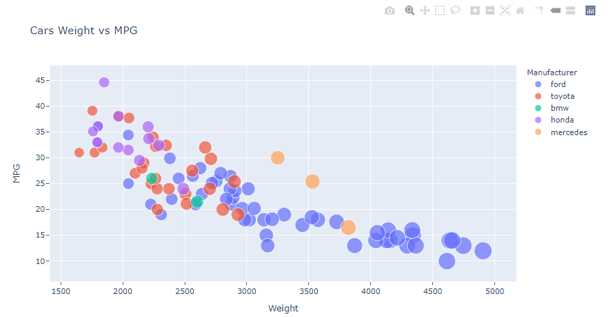

Assignment 2 - Data Visualization, 7 Ways  
===
CS 573: Data Visualization

Due 26 Feb 2021

Imogen Cleaver-Stigum

TODO

- publish shiny app
- design
- tech 
- d3
- excel
- axes + ticks
- r markdown to html/pdf

# 1. d3 (Javascript) TODO

- Write a paragraph for each visualization tool you use. What was easy? Difficult? Where could you see the tool being useful in the future? Did you have to use any hacks or data manipulation to get the right chart?

consistent color choice, font choice, element size (e.g. the size of the circles)

# 2. ggplot2 (R) 

I made a basic ggplot2 scatterplot in R. This included the required features (categorical colors, opacity chance, x and y labels and title, etc), as well we some automatically generated legends that explain the meaning of the colors and weights. 

This plot was one of the easiest to make because I am already familiar with R and ggplot2, and they do not require much code to create. 

# 3. Matplotlib (Python)

Python's library Matplotlib makes basic plots. It is easy to use but it does not automatically provide any extra features. 

One version of my vis has exis ticks and one has a grid. 

# 4. Plotly (Python) TODO

Python's library Plotly creates visualizations with a lot of extra features that come automatically. The basic plot comes with an automatically generated legens for the categorical colors. 

# 5. Plotly (R) TODO

There exists a library Plotly in R which is very similar to the Python library Plotly. I used them both to compare. They are distinct because they use different languages, so you have to write different code to make either plot. However, there are a lot of similarities in the resulting plot. 

Plotly has several extra features 

# 6. Seaborn (Python)

Seaborn also creates plots that do not have a lot of extra features automatically. The plots do have an automatic legends for both colors and marker sizes - however, the color legend specifies the actual colors instead of the categories they represent. 

Seaborn has several built in styles, including:
- white
- whitegrid
- dark
- darkgrid
- ticks

Here is the verstion fo the scatterplot in the whitegrid style:

And here is the version with axis ticks: 

I chose to use the tableau color scheme, which includes olive, cyan, punk, grey, and brown. This color schme is fairly muted and is color blind friendly. 

# 7. Altair (Python)

Altair is yet another Python visualization library. This scatterplot also comes with an automatic legend for the point colors and sizes. 

It also has a menu with options like saving the vis as an svg or a png. 

Altait scatterplots also have a feature where you can zoom in or out with 2 finger scroll, or move around with click adnd drag. 

# 8. Excel TODO

# Technical Achievements 

1. R Shiny App

This app is a technical achievement because I published the R scatterplot so it can be accessed from a URL, as well as implementing dropdown menus to change 3 variables to any of the variables in the .csv file: x, y, and marker size.

2. Hover variables in Python Plotly

I also added an extra variable (Horsepower) to the hover function in Python Plotly, so when you hover you can see horsepower in addition to the other relevant variables. 

# Design Achievements 

1. Color schemes

shiny app make prettier
interactivity
color picker???
dark mode
change to not dots

