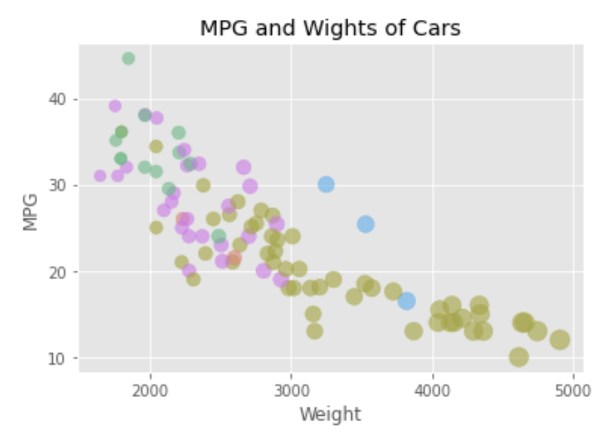
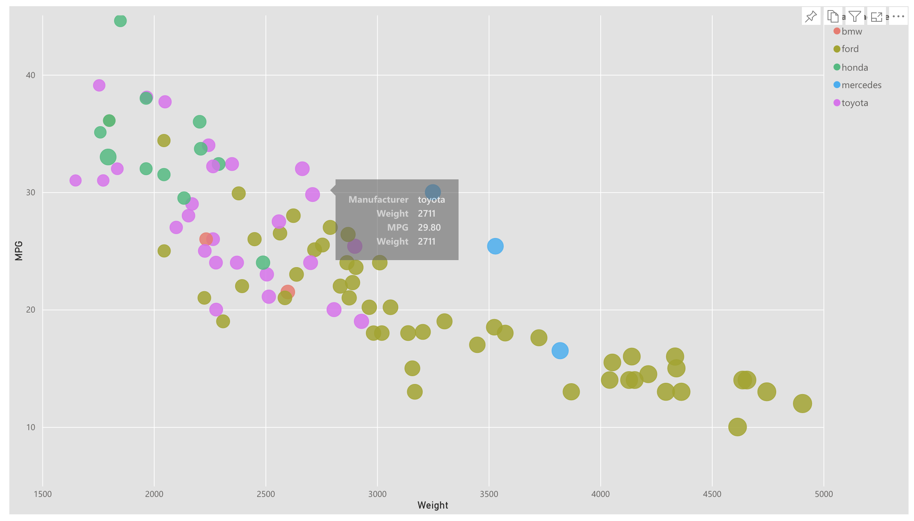
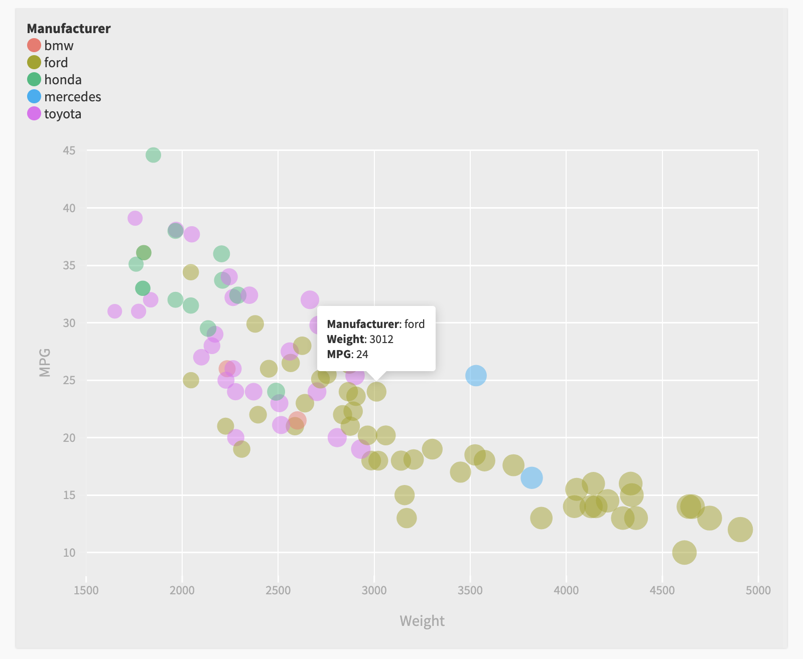

Assignment 2 - Data Visualization, 7 Ways  
===

# R + ggplot2

R is a language primarily focused on statistical computing. ggplot2 is a popular library for charting in R. To visualize the cars dataset, 
I made use of ggplot2's geom_point() layer, with aesthetics functions for the color, size, and opacity. While it takes time to find the right 
resources, these functions made the effort creating this chart minimal with all required features preserved. Also, specifying one value in 
aesthetics function, namely shape, made the scatter plot color-blind friendly by using another channel in addition to colors.	

# D3.js	

D3.js is a javascript library that helps visualize data using HTML, SVG, CSS elements.
Visualizing the dataset in d3 was not very challenging, but it was not easy at the same time. In the beginning, some stuff was confusing,
such as the grid. It took me so much time to do it, and in the end, the result was not the same as what we asked to replicate. So, finally, 
I decided to create the background but without the grid lines. However, the other parts of the vis were relatively easy. I think they were easy
to execute because the dataset is not complicated. But as the dataset gets complex, I think it will be overwhelming to get some stuff done by
novice users.
The good thing about d3 is that it gives the user control over it and not the other way around, unlike other tools used in this project.

# Python + matplotlib + Jupyter notebook

Matplotlib is a python library provides the methods needed for creating data visualizations.
I used Jupyter notebook to create the plot due to its ease in inspecting the data and checking the result immediately.
Visualizing data in Python and using Matplotlib was easy compared with D3. Although it took a little bit of time to figure out
the library, it took a few minutes to get the plot done.		
One of the good things about this library is ggplot themes. It helped me to create the grid with one line. However, customizing the legend
was not very easy, and I could only get the legend inside the plot area, not on the right side of the right axes.

# Tableau

Tableau is a software allows users to visualize data with not only drag/drop but also with scripts to customize some aspects.
Visualizing data in Tableau was very easy. It did not need previous knowledge to have things done; however, it required some hacks to customize
some aspects, such as the legend. To get the Manufacturer's legend correctly, I created the scatter plot and the Weight legend in a sheet.
Then, I created the Manufacturer legend separately in another sheet and did some customization to change the default squares color to circles.
After that, I dragged the scatter plot along with the two legends and dropped them in the dashboard. However, I found it difficult to change
the Weight legend's sizes, so I included 5000. I also added a highlight action to the Manufacturer legend, so when the user clicks on 
a Manufacture from the legend, the plot highlights the corresponding circles. Finally, I created a tooltip that has the car details.				
I also created another scatter plot where I made it color-blind friendly by using another channel, namely shape, in addition to colors.

# PowerBI

PowerBI is a Microsoft service. It provides users with an intuitive and interactive interface.
Visualizing data with PowerBI took a few minutes to get the plot done with interactive features such as tooltip and highlight action.
It is not very customizable. I could not have more than one legend and could not change the legend's position.
Also, changing the opacity of the circle is not an option.				
PowerBI has some other useful features such as sharing the report as a QR code, embedding it on a web page, adding comments to start 
a conversation around the report, or chatting about it in Teams service. The vis can also be exported in different formats such as PowerPoint,
pdf, or analyze in excel.

# Flourish

Flourish is an online editor. It provides users with an intuitive and interactive interface.
Visualizing data in Flourish took a few minutes to get the plot done with interactive features such as tooltip and animation. However, 
it is not very customizable. It is not possible to have more than a legend, and it has a predefined legend position, e.g., above, below, 
or horizontal. Flourish allows users to preview the vis in mobile preview or tablet preview too. 

# Datawrapper

Datawrapper is an online editor that provides users with a more intuitive interface than Flourish. It walks the user through 
steps to get the vis done. It is not very customizable, though. It has almost the same features and constraints as Flourish. 
In addition to that, it has limited grid choices namely white and blue grid.
Datawrapper has a color-blind checker, which is an excellent feature to have, and the user can either copy a link to a responsive code 
to a website or export the vis in different formats such as png, pdf, and SVG.

## Technical Achievements

- **Preparing data**: Since the total number of rows with Null values in MPG, Wight, or Manufacturer columns are 2 out of 98,
that would not cause losing important information. So, I decided to remove these rows. 
Although there were null values in other columns in the dataset, I did not remove them because we only care about MPG, Weight, 
and Manufacturer. So, I did not want to lose values from these columns by removing Null from others.
Before using any tool, I cleaned the data then exported the file to use in all of the tools. Because some of the tools, e.g., Flourish, 
do not give the user a choice to omit the null values after importing the data.
- **Grid**: is created in all tools except d3.
- **Legend**: is created in all of the tools except python.	
- **Tooltip**: is created in all non-library tools.
- **Highlight action**: is added in all non-library tools.

### Design Achievements
- **Color-blind friendly**: Adding additional channel, namely shape, to make the scatter plot color-blind friendly. 
