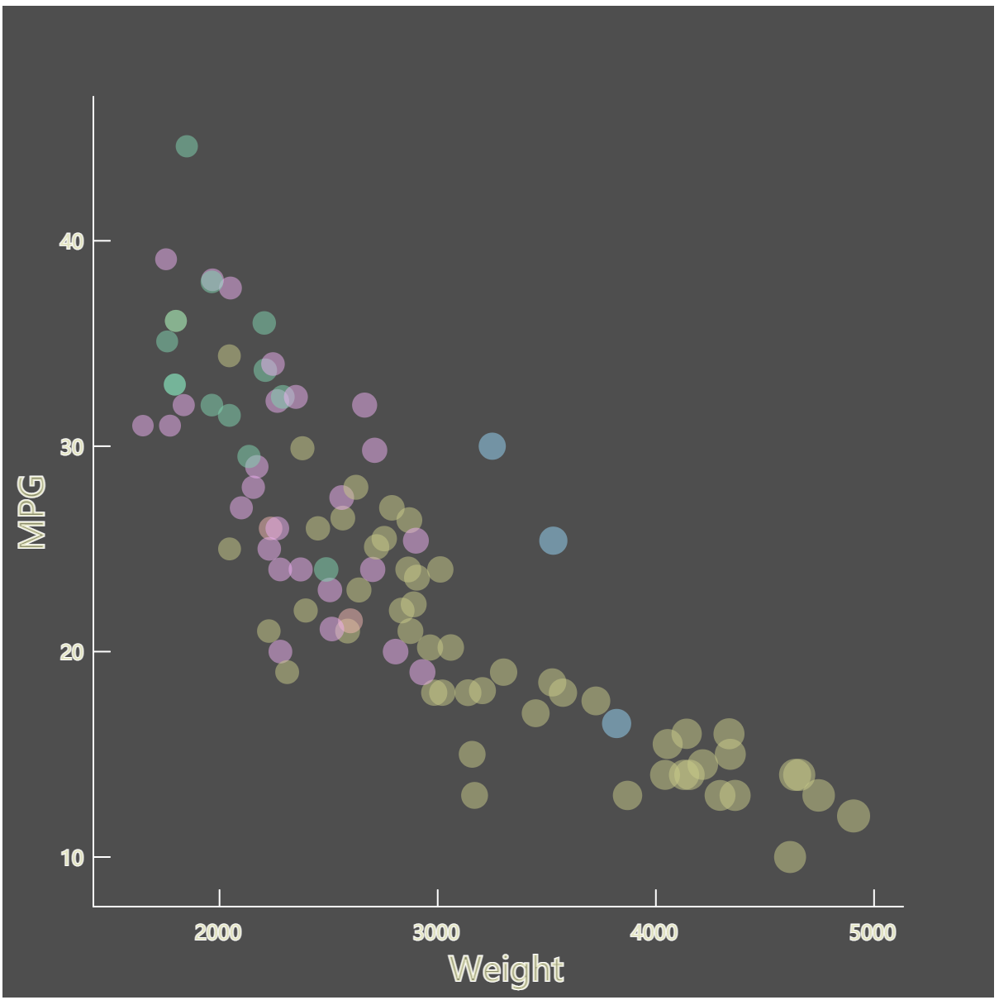
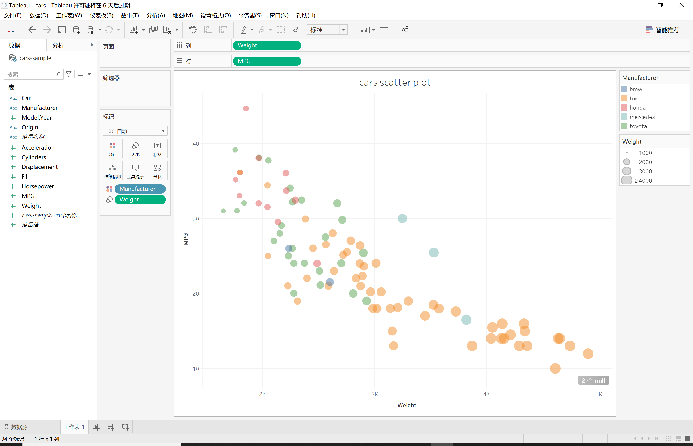

Assignment 2 - Data Visualization, 7 Ways  
===
# D3
GitHub page:https://zihao777.github.io/02-datavis-7ways/ 

JavaScript is the most popular programming language of web in the world. D3.js is a JavaScript library for manipulating documents based on data. Using d3.js allows people to design their own vis with a high degree of control.

To visualize the cars dataset,I used `d3.csv()` to load csv file. I made use of API in `d3.scale` to create scales to map the “Weight” and “x”, "MPG" and “y”, “Weight” and circle size. Then, binded the data to the SVG, added circles to the SVG, and determined the manufacturer type of each data to fill with different colors. I made use of API in `d3-axis` to construct x axis and y axis. I made us of `d3.brush()` to realize the interaction of brush. 

In this progress, I encountered a problem when trying to map "MPG" to "y" because two data in the "MPG" attribute have NA values. In order to solve this problem, I declared a function to check the dataset in advance. If the “MPG” or "Weight" value of a certain data in the data set is NA, I deleted it.  In implementing the brush interaction, although I spent some time viewing the document and code, the final effect was very exciting for me. 

I think D3 is a powerful library for creating vis. Designers can find useful tools to fulfill their specific design requirements.

# P5
P5.js is another JavaScript library. On its website, P5.js is described to creative coding, with a focus on making coding accessible and inclusive for artists, designers, educators, beginners, and anyone else. 

To visualize the cars dataset, I used `loadTable()` to load csv file, used `map()` to map the “Weight” and “x”, "MPG" and “y”, “Weight” and circle size. I made use of `Eclipse()` to draw circles then fill each circle by determining the value of “Manufacturer”.

In this progress, I couldn’t find API for constructing axis. Thus, I used `line()` to draw axis. In addition, in the beginning, I failed to map "MPG" to "y" because two data in the "MPG" attribute have NA values. To solve this problem, I declared a function to check the dataset in advance. If the “MPG” or "Weight" value of a certain data in the data set is NA, I removed this row.  Since the data type returned by `loadTable()` is table object, I spend some time viewing the document and learned to manipulate data table object.

P5.js is an interesting tool for data vis and It is easy to learn. Due to the characteristics of this library, I think it is more suitable to make some interesting animations. For example, I saw a very interesting snowflake animation on the official website(https://p5js.org/examples/simulate-snowflakes.html).

# Vega-Lite
Vega-lite is a high-level grammar to create interactive graph. Its specifications describe visualizations as encoding mappings from data to properties of graphical marks.

To visualize the cars dataset, I set properties for each data to set its coordinates, color and size in Json syntax.

The encoding style of Vega-lite is different with other tools. To create a vis, you don't need to declare a function or many variables. You only need to set properties for the data according to json syntax.

# ggplot2
R is a language which is always used for statistical computing. Ggplot2 is an important library for charting in R. The core idea of ggplot2 is to separate plots from data, and separate plots related to data from plots unrelated to data. Different layers are joined with `+`.

To visualize cars dataset, I set the mapping in the `aes()`. I also made use of ` geom_point()` to create circles. 

The syntax in ggplot2 is concise. Compared with D3, ggplot2 needs less code to create same vis. In addition, ggplot2 can automatically construct legend in chart, which is very convenient.

# matplotlib
Matplotlib is a comprehensive library for creating static, animated, and interactive visualizations in Python. 

To visualize cars dataset, I made use of `ax.scatter()` to create scatter plot. Because I didn’t find API which similar with `scaleLinear()` in matplotlib documentation, so I defined a function to map the weight to circles size.

Authough it tooks some time to check the documentation, these fuctions are convenient to create scatter plot.

# Flourish
Flourish is a web-based visualization tool which announces itself can make beautiful and easy visualization and storytelling. Actually, it is indeed very easy to create a visualization by using Flourish. In its website, I only need to upload a csv file and set the properties I want to display, then vis was created.

In Flourish, every step to create a vis can be completed in the visual interface. The user does not need to code anymore. I think this way is very convenient for people who are not familiar with coding. And it is website based, so, people can create vis anywhere if they have internet and screen-device which can be connected to internet. In addition, when vis is done on its website, a link can be created to share with others, and this link can be used to easily nest this vis in my website page.

However, I think it also have some restriction for professional user, because its templates are set in advance. If people can’t find template which is matched to vis they want create, Flourish will be not good working.

# Tableau
Tableau is a data analysis platform which you must buy the software and download on computer. The software is so easy to get started that it helps people focus on data without spending too much time learning how to use it. 

Similar with Flourish, every step to create a vis can be done in the GUI, without people having any code experience. To create a vis, I only need to upload a csv file and set the properties I want to display.

Different with Flourish, it is as simple as dragging and dropping. In addition, you don’t need to choose a template in advance. The software will automatically create the vis in an acceptable way. Thus, users can focus on the data and dig out the information underlie the data. Moreover, Tableau can automatically create legends and some interactions, giving people a better perception. 

However, I found it is difficult to set specific values for certain properties in Tableau. For example, I want to set specific sizes for the smallest circle and the largest circle but it is difficult. I found that Tableau is easy to set the trend of size changes or change the overall size.

## Technical Achievement
- **Check data whether has NA value in advance**: To visualize the cars dataset, I met problem when trying to map "MPG" to "y" value because two data in "MPG" attribute have NA value. To solve this problem, I declared a function to check the dataset in advance. If data in "MPG" and "Weight" attribute has NA value, I ignored it. Since the data type returned by `loadTable()` in P5.js is table object, I spend some time viewing the document and learned to manipulate data table object.
- **Realize brushing interaction With D3.js**: I made use of `d3.brush()` to enable users to select an area in the chart. Coordinate information will be returned after a mouse event invoking. Using returned coordinate information, determined which circles are in the area and displayed their detail.

### Design Achievements
- In D3.js, if the data have NA value in "MPG" and "Weight" attribute, the number of data which has NA value will be displayed above the chart to remind users. If user moves mouse on it, it will display `There are 2 null values in the csv file`.
- In D3.js, After an area was selected, the circles in this area will have a different appearance. They will change from translucent to solid and their stoke will be green so that they can be distinguished from unselected circles. In addition, the detail information of selected circles will be displayed below the chart in table format.  
- In order to remind user that they can interact in the scatter plot, I added a line of paragraph below the scatter plot. If user brushes an area in scatter, the paragraph disapears, otherwise it appears. 
