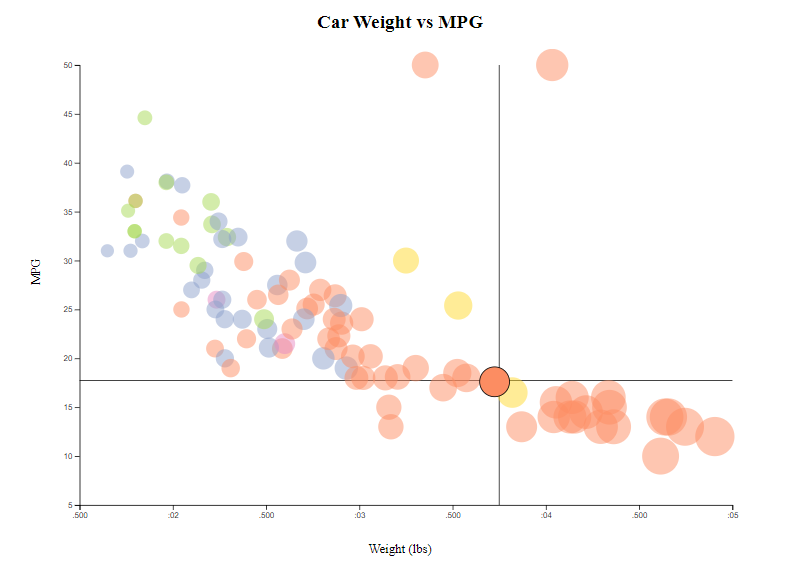
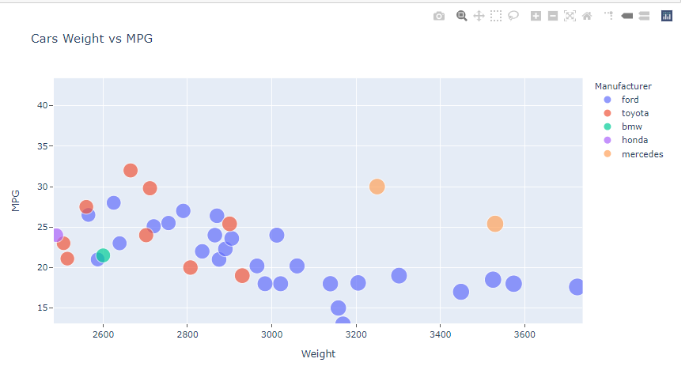

Assignment 2 - Data Visualization, 7 Ways  
===
CS 573: Data Visualization

Due 26 Feb 2021

Imogen Cleaver-Stigum

# 1. d3 (Javascript) 

The d3 page is available here: https://imogencs.github.io/02-datavis-7ways/d3/index.html

Using d3 was trickier than the other libraries at first because you have to create all the graph elements individually rather than having the graph created by the library (appending axes, points, etc). It took more code than the other libraries ot get the basic scatterplot, but it was also more personalizable. 

I used the color scheme from d3: schemeSet2.

Beyond creating the basic scatterplot required, I also made the points become opaque and get a black outline on mouseover so they stand out. The points also come to the front on mouseover, so there are not points drawn later that are still blocking them. I also added crosshairs so you can see exactly where on the axes your mouse is. 

# 2. ggplot2 (R) 

I made a basic ggplot2 scatterplot in R. This included the required features (categorical colors, opacity chance, x and y labels and title, etc), as well we some automatically generated legends that explain the meaning of the colors and weights. 

This plot was one of the easiest to make because I am already familiar with R and ggplot2, and they do not require much code to create. 

I used an R markdown file to make this and the other R plot, so the R folder contains the code (.Rmd) as well as the .html and .pdf versions of the markdown file. 

# 3. Matplotlib (Python)

Python's library Matplotlib makes basic plots. It is easy to use but it does not automatically provide any extra features. 

For this plot I used the tableua color scheme of olive, pink, cyan, brown, and grey. 

One version of my vis has exis ticks and one has a grid. 

# 4. Plotly (Python) 

Python's library Plotly creates visualizations with a lot of extra features that come automatically. The basic plot comes with an automatically generated legens for the categorical colors. 

It also has features that are built in such as a lasso tool and a rectangular selection tool to highlight particular points. It also has a hover feature so if you hover over a point, it provides some informatino about that point. 

Another feature of Plotly is that you can select a section to zoom in on.

The Plotly menu also has other features such a saving the vis. 

Plotly was my favorit library for creating this vis because it required very little code but it came with a lot of features and it looks very clean. However, I did have to add some code to add the tick marks. 

# 5. Plotly (R) 

There exists a library Plotly in R which is very similar to the Python library Plotly. I used them both to compare. They are distinct because they use different languages, so you have to write different code to make either plot. The code is completely different and the plots also look different. However, there are a lot of similarities in the resulting plot. The R version of Plotly also has the the lasso tool, zooming, saving the picture, etc. Unlike Python plotly, R plotly already had tick marks. However, it did not already have the same information when you hover over a point. 

Overall, R's plotly is very good and easy to use.

# 6. Seaborn (Python)

Seaborn also creates plots that do not have a lot of extra features automatically. The plots do have an automatic legends for both colors and marker sizes - however, the color legend specifies the actual colors instead of the categories they represent. 

Seaborn has several built in styles, including:
- white
- whitegrid
- dark
- darkgrid
- ticks

For this plot I used the tableua color scheme of olive, pink, cyan, brown, and grey. 

Here is the verstion fo the scatterplot in the whitegrid style:

And here is the version with axis ticks: 

I chose to use the tableau color scheme, which includes olive, cyan, punk, grey, and brown. This color schme is fairly muted and is color blind friendly. 

Overall, seaborn makes nice looking plots, but the automatic legends are not as good as the other libraries'. 

# 7. Altair (Python)

Altair is yet another Python visualization library. This scatterplot also comes with an automatic legend for the point colors and sizes. 

It also has a menu with options like saving the vis as an svg or a png. 

Altair scatterplots also have a feature where you can zoom in or out with 2 finger scroll, or move around with click adnd drag. 

While these features are good and it was very easy ot use, Altair does not have as many features as Plotly so I prefer plotly. However, it did generate a better legend than plotly did. 

# Technical Achievements 

## 1. R Shiny App

The shiny app is accessible at: https://mango3.shinyapps.io/Cars/

This app is a technical achievement because I published the R scatterplot so it can be accessed from a URL, as well as implementing dropdown menus to change 3 variables to any of the variables in the .csv file: x, y, and marker size. It is a plotly scatterplot so it has the same xtra features built in. It is interesting to see the different variables' relationships. 

The shiny app code is in the Cars folder in the R folder. 

## 2. Hover variables in Python Plotly

I also added an extra variable (Horsepower) to the hover function in Python Plotly, so when you hover you can see horsepower in addition to the other relevant variables. 

## 3. Mouseover events in d3

The mouseover events in the d3 plot (making the point opaque and giving it a black outline, bringing the point to the front, and having crosshairs follow the mouse around on the plot) are technical achievements as well as design achievements because I had to figure out how to have both the crosshairs and the point-mouse-events happen at the same time. At first, the crosshairs got in the way because they were on top of the points so you could never mouse over a point. I solved this by making them out of 4 lines instead of 2 intersecting lines. So there is a 2-pixel-wide gap where the mouse is pointing between the upper and lower halves of the verticla line, as well as between the left and right halves of the horizontal line. This allows to user to mouse over the points without the crosshairs getting in the way. 

There is an empty rectangle behind the plot covering the whole svg so that the crosshairs are still detected when the mouse is over an empty space in the plot, not only when it is directly over a point. 

## 4. Scaling to window

I also made the whole svg and the plot scale to the width of the window at the time the page is loaded. 

# Design Achievements 

## 1. Mouseover events for points in d3

Increasing the opacity of the point to 1 and making the black outline around the point when you mouse over it makes it stand out more, so someone could point out a particular circle on the plot. Bringing the point to the front when it is moused over is also important so you can see the whole circle, not interfered with by any other circles nearby. 

## 2. Crosshairs in d3

The crosshairs in the d3 plot make it easier to tell where a given point in the plot lies on the x and y axes. 

## 3. Color schemes

My plots demonstrate several different color schemes. The Altair plot's color scheme is not color blind friendly, but the rest are. I used d3's
