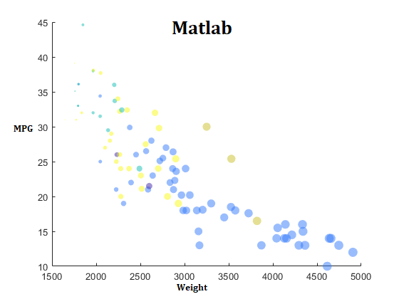

# 02-DataVis-7ways

Assignment 2 - Data Visualization, 7 Ways  
===
## Technical Achievements
Links to the 7 charts that I have done are given below.

I have used the 3 libraries Python, JavaScript and Matlab. Other than these, I have used 4 tools Tableau, DataWrapper, Excel and ScatterPlotOnline.

# D3:
D3 is a JavaScript library for visualizing data with HTML, SVG, and CSS. First, I was trying to load data from the csv file. But it seemed tough for me to fetch and work on it. Then, I have converted the csv file into json and saved as Script.js. In my index.html file, I fetched data from Script.js easily and completed the Scatter Plot smoothly.
# Python:
Python is an interpreted, high-level and general-purpose programming language. Since I have worked on various projects on python, it has been easier for me to implement this project using this language. I have used Pandas library to load data and Matplotlin to show the plot.
# Matlab:
MATLAB is a proprietary multi-paradigm programming language and numeric computing environment developed by MathWorks. I had experience with Matlab just with the data loading part. In this project, I have learned how to code in this language.
# Tableau:
This tool for data visualization was a bit confusing in the first attepmt. For example, after finishing the scatter plot I was struggling with bringing the entire thing in one screen as it was getting distorted when I was trying to do so. But later I have figured out the problem and solved it. 
# DataWrapper:
This is an online tool and I did not face any difficulty while using it.
# Excel:
I have always used excel to view the data. I found Matlab, Tableau etc more comfortable to use as data visualization tool.
# ScatterPlotOnline:
This is an online data visualization tool. It is quite easy to handle.

### Design Achievements
These features have been preserved in my replication:

- Data positioning: it is a downward-trending scatterplot as shown.  Weight is on the x-axis and MPG on the y-axis.
- Scales: The scales do not start at 0.
- Axis labels: both axes are labeled.
- Color mapping is done to Manufacturer.
- Size mapping is done to Weight.
- Opacity of circles has been set to 0.5 or 50%.
