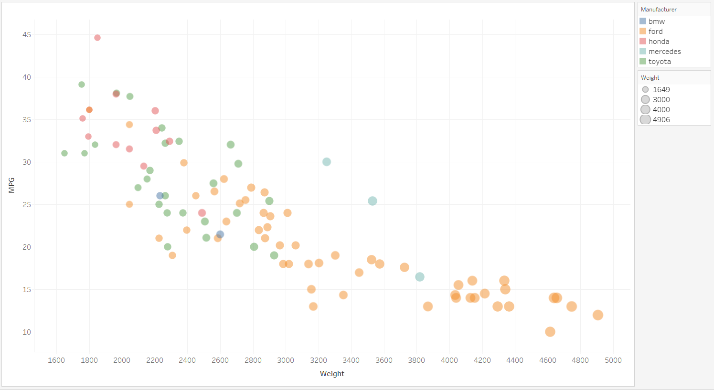

# Tableau

The final tool I looked at was Tableau. Tableau is a data visualization tool created by the similarly named Tableau Software, Inc. The software is designed and used for creating data visualizations. Their revenue in 2018 was 1.2 Billion dollars, so lots of people are using it and you can assume it's pretty good.

My main thought when using this software is that Tableau is incredibly intuitive. It's the only tool that I needed zero documentation to use. It took me longer to get the academic license set up than to actually build the vis. The tool is clearly designed to help users build visualizations. I was able to add all of the required featuers as well as legends without any hacks. I will definitely use this tool again. 

The only downside to Tableau is that it is not a library. The reason I consider it a downside is that if you want to do a visualization that Tableau does not support, you're out of luck. Tableau does seem robust and like it would have everything you could want. But with tools like MATLAB or Matplotlib, it made it easy to do some basic things, but then since they were code I could create my own features. Tableau included all of the correct legends, but if it didn't, I would be stuck and couldn't make a hacky work around like with the programming language options.

## How to Run
- Make sure you have Tableau installed
- Open scatterplot.twb in Tableau
    - If it says it cannot find the data, reconnect the workspace to the sample-cars-imputed.csv file

## Rankings/Stats
This section ranks this tool in several categories compared to the other tools I used for this project:

## Sources
1. Tableau Wikipedia Article: https://en.wikipedia.org/wiki/Tableau_Software
- Tableau was so easy to learn that I did not use any tutorials