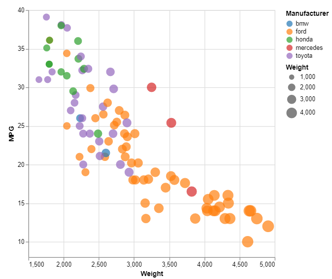

# Vega-Lite

Vega provides an abstraction to d3, and Vega-Lite provides another levels of abstraction on that. This high level language is used to construct JSON that can be rendered into data visualizations. I really like this tool. Maybe it's just that I've worked with JSON a lot, but I was able to learn it really quickly and I think the output looks really nice.

Professor Harrison warned us that the JSON format might be confusing, but I personally thought it actually seemed very organized. You define the objects that make up your larger visualization object and it renders what you say. That said, it does suffer from the same potential drawback a lot of visualization focused tools have, in that if you wanted to make something super creative, you would have trouble customizing beyond their rigorous rules. But, like Tableau that I will discuss next, Vega-Lite does everything I wanted well and quickly for this assignment. It automatically gave me both legends, and it added all of the axes, datapoints, and labels automatically. The documentation and tutorials I found made it really easy to follow and figure out. 

It seems like it has been thoroughly thought through and can be used to visualize pretty much whatever you could need. The one thing I couldn't figure out how to do was determine the number of labels shown per axis. It seems linked to the size of the graph which is odd to me. But apart from that, I loved the JSON format and how portable and structured it feels. I will hopefully be using this tool a  lot more in the future.

## How to Run
- Open the the Vega editor in your favorite web browser, https://vega.github.io/editor/#/
- Paste the contents of scatterplot.json into the editor window
- If it does not run automatically, press the run button to view the visualization

## Rankings/Stats
This section ranks this tool in several categories compared to the other tools I used for this project:

## Sources
1. Loading CSV's in Vega-lite: https://vega.github.io/vega-lite/tutorials/explore.html
2. Changing Size of Graph in Vega-lite: https://vega.github.io/vega-lite/docs/size.html
3. Vega-lite Crash Course: https://www.youtube.com/watch?v=ZV_Yjcs5WtM&ab_channel=Observable
4. Vega-lite Scatter plot: https://vega.github.io/vega-lite/examples/selection_translate_scatterplot_drag.html