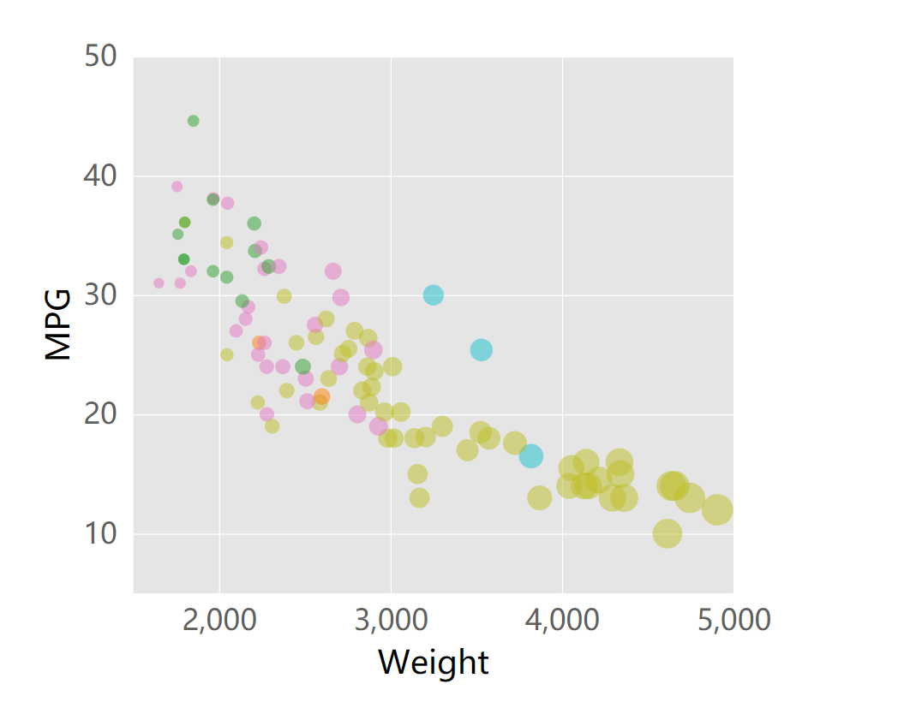

d3
===

Data Driven Documents, d3, is a JavaScript library for manipulating HTML documents based on data [22]. This is usually done by drawing SVGs and appending them somewhere in an HTML document. It is definitely not the easiest tool to use, but it might have been the most fun for me.

d3 is basically just pure JavaScript code with some built in features to help with data vis. This is both intimidating and very helpful, because essentially if you can imagine it, you can code it. It's super open ended. It automates tedious things like plotting every point or every axis label, these can be done in a loop based on your data values. However, unlike the other tools and libraries, you need to specify everything. If you want an axis label you need to add text to your SVG. If you want an axis line you need to draw it. If you want anything, code needs to be written. The other tools I used create a lot of the basic graph elements for you with one function call. For just an axis label, d3 takes a decently long line of code , and you have to specify the placement of it yourself. It won't just automatically add it at the center of the axis.

Specifying all the components of the graph can be tedious for a project like this, especially when other tools automatically do it for you. But if we were to make a more complex graph or add more custimizations, d3 would be the way to go. It's just pure code so we could make anything possible. 

They have lots of great documentation which is a huge plus.

## How to run
- Open a terminal with python 3 installed and change directory to the one with index.html in it
- Type the command >python -m http.server
- Open localhost:8000 in your favorite web browser to view the visualization

## Rankings/Stats
This section ranks this tool in several categories compared to the other tools I used for this project:

Sources
---
1. Colored Bubble Plots in d3: https://www.d3-graph-gallery.com/graph/bubble_color.html
2. d3 Categorical Colors: http://bl.ocks.org/aaizemberg/78bd3dade9593896a59d
3. d3js - d3.scale.category10() not working?: https://stackoverflow.com/questions/41178111/d3js-d3-scale-category10-not-working
4. Building legends in d3.js: https://www.d3-graph-gallery.com/graph/custom_legend.html
5. February 4th's Lecture - CS 573
6. d3 docs: https://d3js.org/