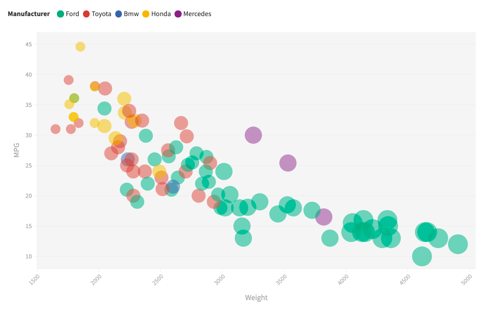
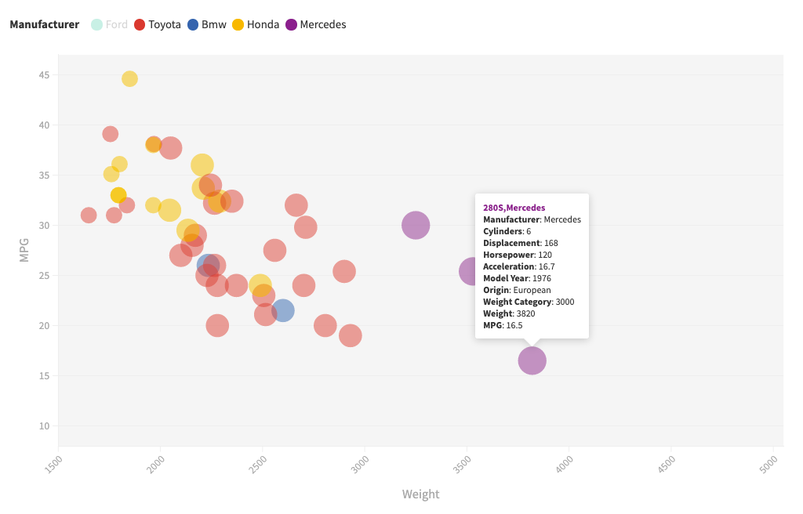
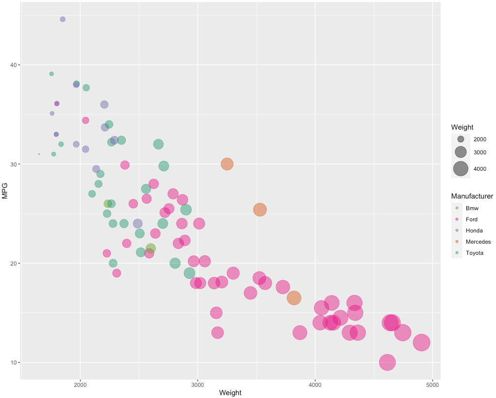
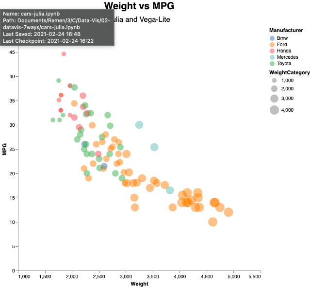
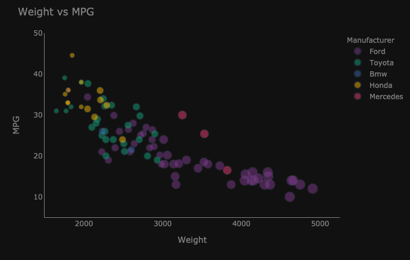
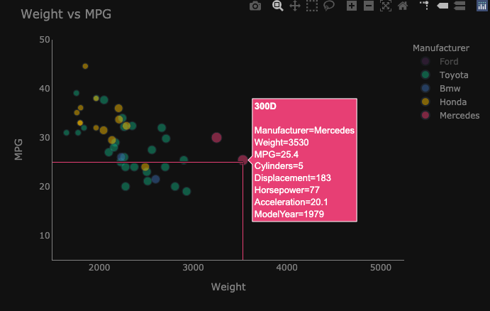

0 Google Sheets
===
- used it for data cleaning
- title case
- deleted rows with n/a
- categories for weight (1000, 2000, 3000, 4000)
- year to 1970 instead of 70

1 Flourish
===
[Flourish Cars Vis](https://public.flourish.studio/visualisation/5352793/)

- wanted to use flourish bc it's really easy to change things -- response time better?
- then base other graphs off of it
- interactive
- using filters to isolate cars from diff manufacturers by clicking on name in legend
- can hover to see car specs
- pretty colors
- unless you pay for it, your vizzes aren't going to be private so you can't use this with any sensitive data

2 R + ggplot2
===

- copied prof harrison's plot almost completely
- not very experienced in r, so process wasn't as smooth as it should've been
- simple code and structure but can accomplish a lot with ggplot
- few lines of code and ready to go :)
- ok with smaller dataset, would be weak against big data unless something like hadoop is used alongside it
- can't be embedded into a web app bc security concerns
- learning curve is kinda steep since it has such specific syntax and functions - would much rather use python instead

3 Julia + Vega Lite
===

- can zoom in and out of the graph
- had to learn julia in order to do this
- documentation is very easy to find, making the graph didn't require a lot of time
- installing the packages did take a lot of time though

4 Python + Plotly
===

- interactive: hover to see more information about the car
- spikelines
- toggle manufacturers in legend
- dark theme

5 Python + Seaborn
===

- super super easy

6 Python + Bokeh
===
- Lots of tools you can add
- color by category was frustrating - not automatic
- size by category was also frustrating

7 d3
===
- https://observablehq.com/@d3/scatterplot