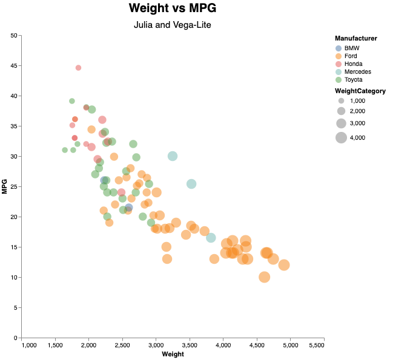
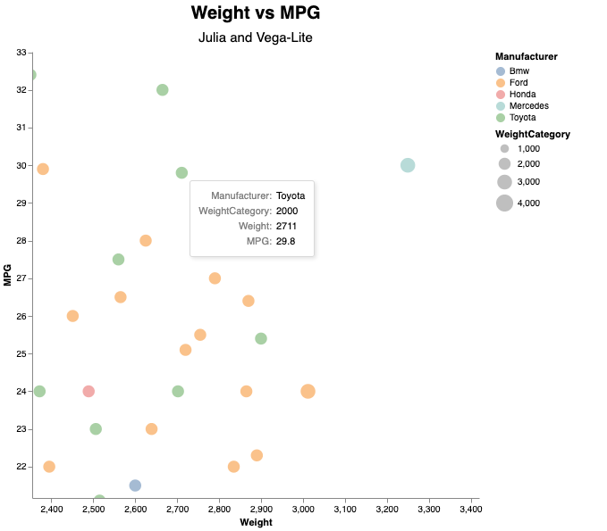
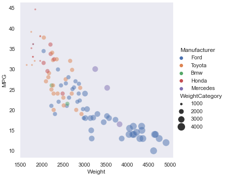
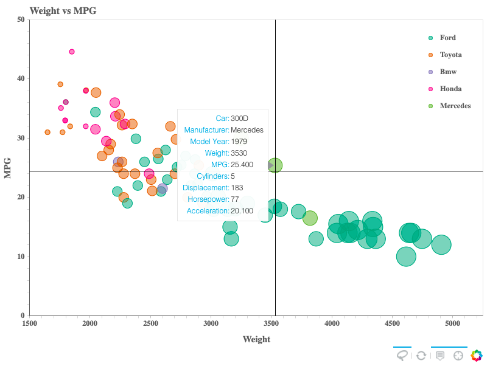
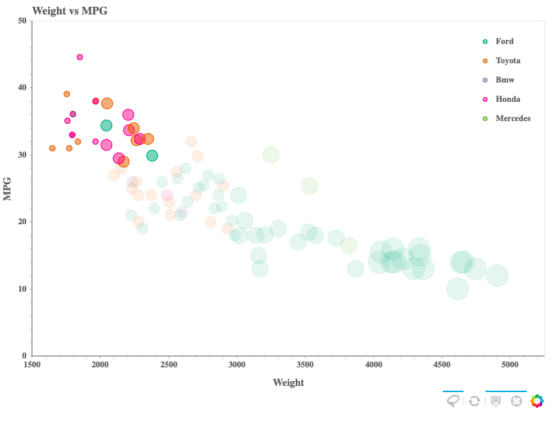
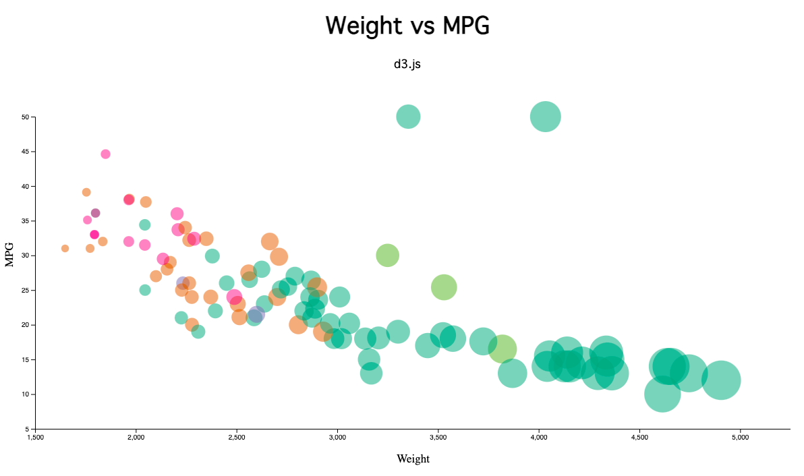

0 Excel
===
> File: `data/cars-excel.xlsx`

Before getting started on the visualizations, I first cleaned the data. I first put all the car names and manufacturer names in title case (except for BMW, which I put in all capital letters), and deleted the rows that had N/A values. I considered filling in the data by googling the missing statistics, but found it too time-consuming and decided to delete the rows entirely instead. I also added a column titled "WeightCategory" which put each car in one of four categories: 1000, 2000, 3000, or 4000. Since small differences in the radii of different circles are extremely hard to see, using categories made the visualizations more easily to grasp. In addition, I changed the years to the format 'yyyy' instead of just 'yy'.

1 Flourish
===
>[Link to the Flourish Viz](https://public.flourish.studio/visualisation/5352793/)

I wanted to use Flourish before using programming languages to hard-code the graphs because on Flourish, it's really easy to change things and experiment. I wanted to see what I liked in the graph in a couple minutes rather than spending hours experimenting with code, and then try to base the other graphs off of this one. The Flourish graph is interactive - you can use filters to isolate cars from different manufacturers by clicking on the name of the manufacturer in the legend. When you hover over each point, you can see all of the other specs for that car. Even though this graph was really easy to make, one downside of using Flourish instead of Python or R or any other programming language is that unless you pay for it, your vizzes aren't going to private so you can't use Flourish with any sensitive or business data.

2 R + ggplot2
===

This is an almost exact replica of Prof Harrison's plot. I'm not very experienced in R, so the process wasn't as smooth or quick as it could've been and that deterred me from experimenting with colors and different features. The code and structure are pretty simple but you can accomplish a lot with ggplot2. Some cons of R and ggplot2 are that it works really well with a smaller dataset, but would be weak against big data unless something like Hadoop is used with it. The learning curve is also kind of steep since it has such specific syntax and functions. Personally, I would much rather use Python instead.

3 Julia + Vega Lite
===

I had never worked in Julia before so like the last graph, I had to learn quite a bit in order to complete this visualization. However, the documentation for VegaLite.jl was very easy to find and also very organized and helpful. I also followed [this tutorial](https://www.queryverse.org/VegaLite.jl/stable/gettingstarted/tutorial/) for making a scatterplot using VegaLite.jl, and altered it so that the markers were sized and colored, and so that they displayed tooltips. Thus, making the graph didn't require a lot of time. However, installing and including the packages *did* take a lot of time.

### Technical Achievements:
- You can zoom in and out of the graph when you scroll
- When you hover over each point, a tooltip pops up with more information about the car

4 Python + Plotly
===

Making this graph was very fun, I love working in Python. Since plotly was so popular, it wasn't hard to find help for something I was stuck on because there are so many forums and documentation out there. I used [this article](https://dylancastillo.co/4-ways-to-improve-your-plotly-graphs/) to help me implement the spikelines.

### Technical Achievements:
- The visualization is interactive, and you can hover over each point to see more information about the car (tooltips)
- I included spikelines, which helps you see where you are on the graph, and lets you see which for which point the current tooltip is for
- In the legend, you can toggle cars from different manufacturers

### Design Achievements
- The dark theme makes all of the colors stand out more, and is less harsh on the eye than the default white or gray themes for most languages and libraries
- The tooltip and crosshairs are the same color as the marker that you are hovering over
- The crosshairs disappear when you move away from the marker you were just hovering over so you can see the other markers more clearly

5 Python + Seaborn
===

Making this graph was super easy, and it only took about a dozen lines of code. For the same bubble chart, using seaborn instead of plotly does reduce the amount of lines of code you need, but plotly makes it very easy for the visualizations to be interactive.

### Design Achievements
- Added a gray background and changed the color of the markers to be more easily differentiable by switching to another theme

6 Python + Bokeh
===

Since I had never used bokeh before, I followed [this series of tutorials](https://docs.bokeh.org/en/latest/docs/first_steps/first_steps_4.html) that the bokeh website provides in order to first install it, then create a graph. The tutorials also included how to customize your graph so that it included tooltips, crosshairs, and a floating menu, so I added those to my graph as well. However, the tutorials didn't include anything on coloring or sizing markers by a certain category because it focused on simple scatterplots.

### Technical Achievements
- You can hover each point to see more information about the car (tooltips)
- Crosshairs will follow your mouse across the graph
- You can select a region of dots using the lasso tool, and it will gray out the dots you didn't select

7 d3.js
===

For this graph, I used [this tutorial](https://observablehq.com/@d3/scatterplot) on the d3 website to make a simple scatterplot, then changed it so that it became a bubble plot. The tutorial also used version 4 of d3 so I had to alter some of the code to fit version 6. Though d3 offers much greater flexibility and customization than other languages like Python, R, and Julia, it takes much more effort to create a simple chart and it can get pretty confusing because there are so many components and elements you need to keep track of.